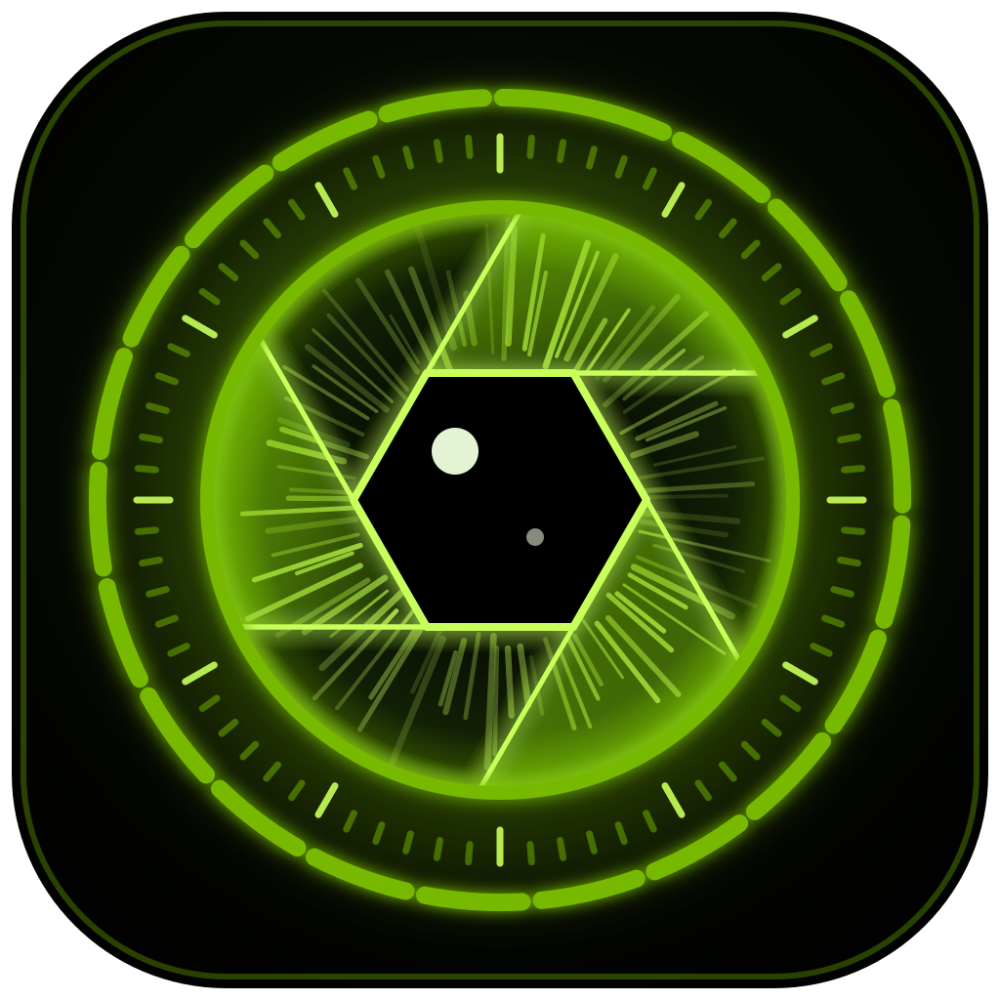
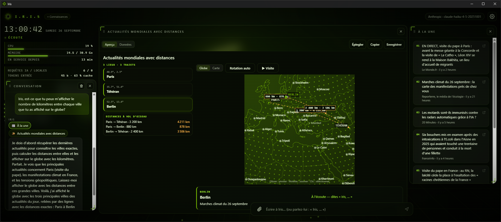
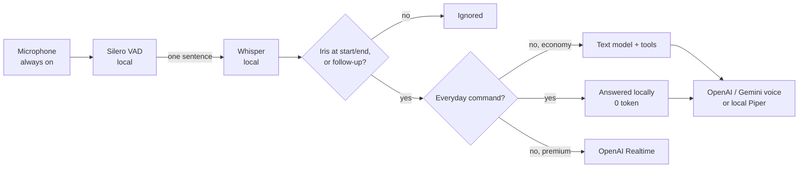
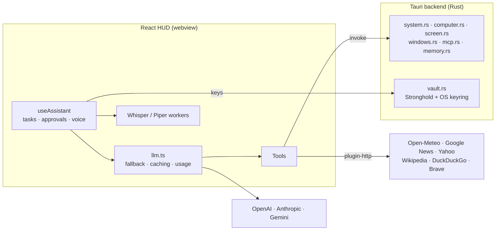

<p align="center"></p>

# I.R.I.S.

> **Iris** is an AI assistant with a holographic HUD, always-on local voice, long-term memory, web access, control of your computer, connected services and self-written skills — built to spend as few tokens as possible.



Iris is built with **Tauri 2 (Rust)** and **React 19 / TypeScript** and runs on **Windows, macOS, Linux, Android and iOS**. It thinks with cloud LLMs (OpenAI, Anthropic or Google Gemini, with automatic fallback). It listens **locally**: voice detection and Whisper run on your device, so nothing leaves it until you say "Iris". On desktop it **lives in the background** (tray / menu bar, plus a small always-on-top window). The interface is a green-on-black HUD built around Iris's animated 3D eye, adapts from a phone to a large screen, and speaks **14 languages**.

## Contents

[Platforms](#platforms) · [Features](#features) · [Token economy](#token-economy) · [How it works](#how-it-works) · [Getting started](#getting-started) · [Configuration](#configuration) · [Using Iris](#using-iris) · [Tools](#tools) · [Security](#security) · [Data](#where-data-is-stored) · [Limitations](#limitations) · [Roadmap](#roadmap)

---

## Platforms

One codebase, the same features everywhere the OS allows them.

| | Windows | macOS | Linux | Android / iOS |
|---|---|---|---|---|
| Builds | x64, ARM64 | universal (Apple Silicon + Intel) | x64, ARM64 · .deb, .rpm, AppImage, Flatpak | Android arm64 · iOS |
| HUD, conversation, voice, memory, web, widgets, creation, alerts, schedule | ✅ | ✅ | ✅ | ✅ |
| Tray / menu bar, mini window, Ctrl+Shift+J, start at login | ✅ | ✅ (Dock click reopens) | ✅ (tray menu; on Wayland the shortcut goes through the desktop portal²) | — (full-screen app) |
| Updates from inside the app | ✅ | ✅ | ✅ AppImage (.deb, .rpm, Flatpak: the system's tools) | — (store) |
| Listening while Iris is not on screen | ✅ (tray) | ✅ (menu bar) | ✅ (tray) | Android: ✅ (notification) · iOS: — ³ |
| Open apps, volume, files, shell commands, Trash | ✅ | ✅ | ✅ (`.desktop` entries, pactl / wpctl / amixer) | files in the app's sandbox only |
| Window management (`manage_window`) | Win32 | System Events¹ | EWMH over X11² | — |
| Look at the screen, mouse & keyboard (`use_computer`) | ✅ + UI Automation elements | ✅ (screenshot-guided)¹ | ✅ (screenshot-guided)² | — |
| MCP servers | ✅ | ✅ | ✅ | — (no child processes) |

¹ macOS asks once for **Screen Recording**, **Accessibility** and **Automation (System Events)**.
² On a **Wayland** session only XWayland windows can be listed and driven; Ctrl+Shift+J is asked from the desktop portal's *GlobalShortcuts* (GNOME 48+, KDE Plasma 5.27+, which may ask you to confirm it) and screenshots go through the portal too.
³ iOS suspends the webview's microphone in the background: Iris finishes speaking, and listens again as soon as she is back on screen. Android keeps listening through a foreground service, shown as an ongoing notification (with *Quit*).

**Responsive HUD.** Above 900 × 560 px the panels float and can be dragged and resized. On a phone or a small window, a **compact layout** shows one panel at a time (eye, conversation, cards, visual, dashboard, knowledge graph, telemetry) with tabs; a new card or visual comes to the front by itself. Safe areas (notch, gesture bar), touch targets and 16 px fields (no iOS zoom) are handled.

---

## Features

### 🎙️ Voice — always listening, no button
- **Local listening**: Silero VAD cuts sentences, **Whisper small on the GPU** (WebGPU; Whisper base on the CPU otherwise, and on phones and tablets) transcribes them on the device. The telemetry shows which one runs, and where (GPU / CPU).
- **Only her name triggers her**, at the start or end of a sentence (*"Iris, open the calculator"*, *"…, Iris, please"*; usual misspellings accepted). The one exception: the answer to a question she just asked, within 8 s.
- **Talking over her pauses her** mid-syllable; with "Iris" in your sentence she drops her reply, otherwise she resumes (at most 12 s later). *"Iris, stop"* or **Esc** silence her.
- **Voice recognition** (optional): three sentences give a 256-number voiceprint (never audio). Iris can then answer only known voices, and keeps only the stretches spoken by one when others talk around you. Manage voices in *Settings → Recognised voices*.
- **Standby** (*"stop listening"*), **"Iris?"** → *"Yes, sir?"* (0 tokens), and **instant acknowledgements** (*"Let me check."*) pre-synthesized at launch.
- **Two modes**: *Economy* (default: local transcript → text model → speech, text tokens only) and *Premium* (OpenAI Realtime over WebRTC, opened only when addressed, closed after 30 s).
- **Her voice follows the account**: OpenAI or Gemini natural voices, or the free offline **Piper** voice (default with Claude).
- **Low latency, streamed end to end** (economy voice): at the first short pause Whisper already transcribes the sentence (*speculative transcription*): when you have finished, the text is ready, and a sentence that clearly ends (*"…?"*) doesn't wait for the full silence. *"Iris, …"* is recognised before the end of the sentence (she stops talking at once). The reply is spoken from its **first clause**, and OpenAI's voice **plays while it is synthesized** (streamed PCM). The telemetry shows the latency: end of your sentence → first sound.

### 🪟 Background mode (desktop)
Closing the window keeps Iris in the tray / menu bar, listening. A **mini window** (eye, status, last reply, and a field to **write to Iris** when you can't speak) stays on top; **Ctrl+Shift+J** or the tray toggles the interface. By voice: *"show yourself"*, *"hide"*, *"move to the top left"*, *"hide the mini window"*. **Start at login** is opt-in (Settings → Personality).

### 🖱️ Windows, mouse and keyboard (desktop)
- `manage_window`: focus, minimize, maximize, restore, close (politely) or move a window to a half, quarter, centre or the next screen — found by words of its title, no screenshot.
- `use_computer`: a vision sub-agent works one action at a time (click, type, shortcut, scroll, drag, wait), up to 20 steps, from a screenshot plus — on Windows — the window's accessible elements. It stops on **Esc or any mouse movement**, hands irreversible actions back to you and never types passwords.
- `look_at_screen`: *"what am I looking at?"* — only the vision model's description enters the conversation.

### 🧠 Memory
Facts (*"remember that…"* / *"forget…"*), learned facts from summaries (optional), archived past conversations searched with `recall_memory`, and a **knowledge graph** of people, places, projects and their relations, filled by the same summary call (no extra request). Sessions start fresh by default (the previous one is archived); *Resume the last conversation* restores it.
- **Search by meaning** (`semantic.ts`): a small multilingual model on the device (E5 small, ~120 MB once) embeds every memory; *"my sister's wedding"* finds *"Julie is getting married on June 12"*, whatever the words or the language. `recall_memory` uses it first (then keywords), and before each request the few memories closest to it join the message — so facts older than the 40 always in the instructions are not forgotten. Nothing leaves the device.
- **The same Iris everywhere** (`sync.ts`): facts, past conversations' summaries, the knowledge graph and deletions sync between your computer and your phone through storage you own — a **WebDAV** folder (Nextcloud, kDrive, Koofr…) or a **secret GitHub Gist** — **end-to-end encrypted** (AES-256-GCM, key derived from your passphrase with PBKDF2; the storage only sees ciphertext). Each device merges: nothing is lost when both changed; a deletion or a *"forget everything"* reaches every device. *Settings → Sync between devices*.

### 💡 Initiative
Iris speaks up by herself when something deserves it (`proactive.ts`), like a real assistant:
- *"Sir, "Product review" starts in 10 minutes (room 2)."* — from your **calendars** (private `.ics` addresses: Google, iCloud, Outlook, Nextcloud…);
- *"Claire wrote to you about the quote; shall I read it to you?"* — an **e-mail** from someone who matters (a person of the knowledge graph) or marked urgent, with what Iris remembers about them; the others are grouped (*"you have 6 new e-mails, would you like a summary?"*). Read only, over IMAP: nothing is ever marked as read or sent;
- *"Rain is likely in Lyon around 5 pm."* — **rain** coming in your city;
- *"Good morning, sir. Would you like your morning briefing?"* — the **morning briefing** (agenda, e-mails, weather) the first time you are there;
- once a day, **what your memory says about today** (a birthday, a deadline, a trip).
Cheap by design: the watching is local and free, most lines are ready-made; the model only writes the ones that need judgement (an important e-mail, the day's memories: one small call a day). Never during the **quiet hours** (10 pm – 7 am by default), only when someone is at the computer (keyboard / mouse activity, or speech), never while Iris is busy or you are talking to her, at most every 8 minutes (meeting reminders excepted), 12 times a day. Answering *"yes"* just continues the conversation: the calendar and e-mail tools (`check_calendar`, `check_email`, `read_email`) are ready. *Settings → Initiative*.

### 🔌 Connected services (MCP)
Standard `mcpServers` JSON in *Settings → Connected services*, stored encrypted. Each server tool becomes `mcp_<server>_<tool>`; non-read-only tools ask for approval outside autonomous mode. Command servers are started by Rust; URL servers go through `mcp-remote` (Node.js).

### 🔔 Alerts, ⏰ reminders and ⚡ local answers
- `set_alert` watches quotes (Yahoo, every minute) or the weather (Open-Meteo, every 10 min) **locally, with no tokens**, fires once, survives restarts.
- `schedule_task`: reminders, requests or dashboards at a time or on given days, persistent, with *"May I interrupt?"* when you're busy; missed one-off reminders are said at the next launch. Timers survive restarts too.
- **0-token answers**: time, date, timers, volume, opening apps, showing/moving windows, dashboards, stop, standby — in French and English.

### 🌐 Live information
News, weather, stocks/crypto/FX with history, Wikipedia, **free web search** (DuckDuckGo → Brave → Google News → Wikipedia; Tavily first if you add its key) with recency filters, and reading any page (only the relevant passages are kept). Results appear as cards; Iris speaks a short summary.

### 📊 Widgets and ✨ creation
- `show_data` sends only data (~50–300 tokens) to ready-made widgets: **interactive globe / flat map** (free geocoding, routes with great-circle distances, heat maps per country, zoom by voice, guided tours following her voice, major cities, coastlines and borders), **charts**, sortable **tables**, **key figures**, **timelines**, **cards**. Quotes and weather can be **live** (refreshed without AI). Widgets can be **pinned to named dashboards** restored at launch.
- `create_visual` streams web pages, apps, games, diagrams, documents and code into a sandboxed panel (view code, copy, save, open in browser); `generate_image` uses OpenAI or Gemini.
- Documents: PDF, images, Word, text — sent with the question and two follow-ups, then re-attached on demand.
- **Self-improvement**: when no tool fits, Iris writes a skill (script, public HTTP API call or procedure), installs it after approval and uses it.

### 🛸 The HUD
3D eye (aperture blades, fibres, voice bars, bloom) that breathes, listens, thinks and speaks; glass panels (drag, resize from any edge, Iris can rearrange them); conversation that follows the reply; knowledge graph; animated market charts; per-tool sound cues; telemetry with CPU, memory and a **cost meter** (tokens, cache share, € and USD per day and month, savings, daily budget); cinematic boot; model speed test.

---

## Token economy

| Measure | Effect |
|---|---|
| Local listening + economy voice | Nothing is sent before "Iris"; spoken requests cost text tokens, not Realtime audio. |
| Local answers (`localCommands.ts`) | Time, date, timers, volume, apps, windows, stop: **0 tokens**. |
| Dynamic tool selection (`toolGroups.ts`) | Core tools always, other groups by a local intent check or `load_tools`: **−48 % to −65 %** of tool tokens per step. |
| Prompt caching | Stable instructions (clock and language go with the latest message); explicit for Anthropic, cache key for OpenAI, explicit context cache for Gemini (`geminiCache.ts`). |
| Lean history | Fresh sessions, summaries beyond ~10 exchanges, older tool results cut to 700 chars between steps, documents re-sent only when needed, screenshots kept as text. |
| Lean web | ~4,000 relevant characters per page, 6 × 300-char search results, tool results cached (2 min to 24 h). |
| Widgets instead of generated UI | 50–300 tokens of data instead of 3,000–8,000 of generated page. |
| Model routing + short thinking | Inexpensive model for conversation, stronger one for visuals and code, both picked from your key's model list; low reasoning effort for conversation. |
| Free local work | Piper voice, alerts, live widgets and dashboards cost nothing. |

---

## How it works





`useAssistant.send()` tries a local command first; otherwise it creates a task, selects tools, and streams the answer (Vercel AI SDK, up to 6 tool steps), speaking it sentence by sentence. Tools only **propose** actions: outside autonomous mode an approval card must be accepted before Rust runs them, and Rust applies its own checks. The same web app renders the main HUD and the desktop mini window (`App.tsx` checks the window label). OS specifics live behind `cfg` in Rust (`windows.rs`, `computer.rs`, `system.rs`) and `src/lib/platform.ts` in the UI, which also removes desktop-only tools on phones.

**Stack**: Tauri 2 (plugins http, opener, stronghold, log, global-shortcut, autostart, updater, process) · `xcap`, `enigo`, `uiautomation` + `windows` (Windows), System Events (macOS), `x11rb` + `ashpd` (Linux: X11 and the Wayland portal) · `netguard.rs` (public addresses only), `visuals.rs` (the `visual://` origin), `sandbox.rs` (Flatpak) · React 19, TypeScript 6, Vite 8 · Vercel AI SDK 7 + Zod · `@ricky0123/vad-web`, `@huggingface/transformers`, Piper · Three.js / React Three Fiber, Framer Motion, React Flow · Stronghold + `keyring`.

**Layout**: `src/features/assistant/` (brain, tools, voice), `src/features/hud/` (HUD, widgets, maps, compact layout), `src/lib/` (settings, memory, costs, platform…), `src/i18n/` (one file per language, typed against `en.ts`), `src-tauri/src/` (Rust commands).

---

## Getting started

### Prerequisites
- **Node.js** 20.19+ or 22.12+, **Rust** stable ([rustup](https://rustup.rs)), and the [Tauri 2 prerequisites](https://tauri.app/start/prerequisites/) for your system.
- **Linux** (Debian/Ubuntu names):
  ```bash
  sudo apt install libwebkit2gtk-4.1-dev libayatana-appindicator3-dev librsvg2-dev patchelf libssl-dev \
    libdbus-1-dev libxdo-dev libpipewire-0.3-dev libclang-dev libgbm-dev libegl-dev libwayland-dev \
    libxcb1-dev libxcb-randr0-dev libxcb-shm0-dev
  ```
  At runtime: a Secret Service (GNOME Keyring / KWallet; without one, the vault password is kept in a private file) and `pactl`, `wpctl` or `amixer` for the volume.
- **Android**: Android Studio (SDK + NDK), Java 17, `rustup target add aarch64-linux-android` (APKs are built for arm64-v8a, which every phone able to run Iris uses; add `x86_64-linux-android` for an x86_64 emulator).
- **iOS**: a Mac with Xcode, `rustup target add aarch64-apple-ios aarch64-apple-ios-sim`, and an Apple developer team to sign.
- A WebGPU-capable GPU is recommended for local speech recognition, and at least one API key (OpenAI, Anthropic or Gemini).

### Run and build
```bash
npm install
npm run tauri dev          # desktop, Vite on :1420
npm run tauri build        # installers in src-tauri/target/release/bundle/

npm run android:init       # once: generates src-tauri/gen/android (+ microphone permission, icons)
npm run android:dev        # device or emulator
npm run android:build

npm run ios:init           # once, on a Mac
npm run ios:dev
npm run ios:build

# Flatpak (Linux), from the .deb built above (as the CI does):
cp src-tauri/target/release/bundle/deb/*_amd64.deb flatpak/iris.deb
git clone --depth 1 https://github.com/flathub/shared-modules.git flatpak/shared-modules
flatpak-builder --user --install --force-clean build-flatpak flatpak/com.iris.assistant.yml
```
The first Rust build takes several minutes. Whisper (≈ 390 MB small / 73 MB base) and Piper voices (≈ 60 MB) are downloaded once, on first use.

### Tests
```bash
npm test                                             # Vitest: tools, maps, alerts, costs, i18n, platform…
cd src-tauri && cargo test                           # Rust unit tests
cd src-tauri && cargo test -- --ignored --nocapture  # desktop tests (moves the mouse!) + search engines
```
CI (`.github/workflows/`) type-checks and tests on every push, builds installers for Windows (x64, ARM64), macOS (universal) and Linux (x64, ARM64, plus a Flatpak), an arm64 APK for Android, and the app for the iOS Simulator. Installers are attached to each run (**Artifacts**); pushing a tag `v*` (e.g. `v0.2.0`) also drafts a **GitHub Release** with all of them and, when the updater key is set, the `latest.json` that installed copies of Iris check: **publishing the draft** is what offers the update.

### Signing

Optional: add these **repository secrets** (*Settings → Secrets and variables → Actions*) and CI signs what it builds; without them the builds are unsigned (SmartScreen / Gatekeeper warnings, debug APK).

| Platform | Secrets | Notes |
|---|---|---|
| Windows — certificate file | `WINDOWS_CERTIFICATE`, `WINDOWS_CERTIFICATE_PASSWORD` | Base64 of a `.pfx`. Since 2023, OV/EV certificates are issued on hardware tokens and can't be exported: use Azure below for a new one. |
| Windows — Azure Trusted Signing | `AZURE_TENANT_ID`, `AZURE_CLIENT_ID`, `AZURE_CLIENT_SECRET`, `AZURE_SIGNING_ENDPOINT`, `AZURE_SIGNING_ACCOUNT`, `AZURE_SIGNING_PROFILE` | An app registration with the *Trusted Signing Certificate Profile Signer* role; endpoint such as `https://weu.codesigning.azure.net`. |
| macOS | `APPLE_CERTIFICATE`, `APPLE_CERTIFICATE_PASSWORD` | Base64 of a *Developer ID Application* `.p12` (Apple Developer Program). |
| macOS notarization | `APPLE_ID`, `APPLE_PASSWORD`, `APPLE_TEAM_ID` | `APPLE_PASSWORD` is an [app-specific password](https://account.apple.com). |
| Android | `ANDROID_KEYSTORE`, `ANDROID_KEYSTORE_PASSWORD`, `ANDROID_KEY_ALIAS` (+ `ANDROID_KEY_PASSWORD` if different) | Base64 of a `.jks`; CI then builds a signed release APK and an AAB for the Play Store. |
| Updates (all desktops) | `TAURI_SIGNING_PRIVATE_KEY` (+ `TAURI_SIGNING_PRIVATE_KEY_PASSWORD` if it has one) | The content of the private key whose public half is `plugins.updater.pubkey` in `tauri.conf.json`. Iris only installs updates signed with it. |

```bash
# Updater key pair — only if you replace the one already configured (the public key then goes
# into tauri.conf.json → plugins.updater.pubkey; copies signed with the old key stop updating):
npx tauri signer generate -w ~/.tauri/iris-updater.key
```

```bash
# Android upload key (keep it safe: every update must be signed with it)
keytool -genkey -v -keystore iris.jks -keyalg RSA -keysize 2048 -validity 10000 -alias iris
# Base64 for a secret — macOS / Linux:
base64 -i iris.jks | tr -d '\n'
# Windows (PowerShell):
[Convert]::ToBase64String([IO.File]::ReadAllBytes("iris.jks")) | Set-Clipboard
```
Avoid backslashes in the Android passwords (`keystore.properties` treats them as escapes). Locally, the same signing works with `src-tauri/gen/android/keystore.properties` (`storeFile`, `storePassword`, `keyAlias`, `keyPassword`; git-ignored). iOS apps are signed by Xcode with your Apple team.

---

## Configuration

First launch opens a **guided setup**: interface language, **AI account** (OpenAI, Gemini or Claude — the key is checked and models are picked automatically; with Claude, an optional OpenAI/Gemini key adds natural voice and images), **your voice** (optional), then a few options. *Settings → AI account → Disconnect* switches provider.

| Setting | Default | Notes |
|---|---|---|
| Voice mode | Economy | Premium = OpenAI Realtime (audio tokens) |
| Iris's voice | Natural | Or the free local Piper voice |
| Models | Automatic | Per provider: newest mini / Haiku / Flash for conversation, GPT / Sonnet / Pro for visuals and code; editable |
| Backup providers | none | *Advanced*: used if the main one fails or is slow (7 s) |
| Long-term memory / Resume last conversation | on / off | |
| Start at login | off | Windows, macOS, Linux |
| Interface language | English | 14 languages; Iris answers in the language you speak |
| Autonomous mode | **on** | Off → approval cards for actions |
| Daily budget, model prices | none, list prices | Settings → Costs |
| MCP servers, Tavily key, honorific, sounds, barge-in | — | |

---

## Using Iris

| Input | Action |
|---|---|
| **"Iris, …"** / **"…, Iris"** | Talk to her (the microphone is always on) |
| **"Iris?"** / **"Iris, stop"** / **Esc** | Attention / cut her off |
| **"Iris, stop listening"** | Standby: only her name wakes her |
| **Ctrl+Shift+J**, tray icon, Dock icon | Show / hide the interface (desktop) |
| **Enter / Esc** on an approval card | Allow / decline (or say *yes* / *no*) |
| 📎 or drag & drop | Attach PDF, image, Word or text files |
| Double-click a panel header | Reset its layout (full layout) |
| Tabs under the top bar | Switch panels (compact layout) |

---

## Tools

| Tool | Approval* | Description |
|---|---|---|
| `get_news` / `get_weather` / `get_stock_quote` / `lookup_wikipedia` / `search_web` / `read_webpage` | No | Live information, shown as cards |
| `show_data` / `pin_widget` / `show_dashboard` | No | Widgets and dashboards |
| `create_visual` / `generate_image` | No | Creation |
| `list_folder` | No | Folder listing |
| `open_app` / `open_website` / `open_file_or_folder` / `set_volume` | Low | Launch or open things, volume |
| `create_folder` / `move_or_rename` / `write_text_file` | Medium | Never overwrite (unless asked) |
| `delete_to_trash` / `run_command` | High | Recycle Bin / Trash; PowerShell or `sh`, 60 s |
| `list_windows` / `manage_window` / `use_computer` / `look_at_screen` | Low–High | Desktop only |
| `set_timer` / `schedule_task` / `set_alert` (+ cancel) | No | Persistent |
| `arrange_panels` / `control_window` | No | HUD layout, Iris's windows |
| `remember` / `forget` / `recall_memory` | No | Memory |
| `create_skill` / `run_skill` / `skill_*` / `mcp_*` | Yes | Skills, external services |

\* In approval mode. In autonomous mode (default) nothing asks — except risky actions after outside content (web, documents, screen, MCP) in the same request.

---

## Security

- **Keys** in a Stronghold vault whose random 256-bit password lives in the OS credential store (Windows Credential Manager, macOS Keychain, Linux Secret Service; a private file on phones or without a Secret Service).
- **Microphone** analysed locally; audio only leaves after "Iris".
- **Approvals** show exact parameters and a risk level; **prompt injection** guard: after reading outside content, risky actions ask even in autonomous mode (`untrusted.ts`).
- **Rust guards**: absolute paths, protected system folders on every OS, no overwriting, deletion to the Trash, validated app names, whitelisted volume actions.
- **Public internet only** for `read_webpage` / web search and HTTP skills (`netguard.rs`): no `localhost`, private network, link-local or cloud-metadata address, whether written in the URL, reached through a redirect or behind a DNS name.
- **Content Security Policy** on the HUD: no inline or remote scripts, no plugins, network access limited to the model and voice services Iris uses (everything else goes through Rust).
- **Sandboxed visuals** (`<iframe sandbox>` without same-origin, served from their own `visual://` origin), **screen** captured only on request and never stored, **MCP** servers only from your own configuration.
- **Signed updates**: the updater installs only packages signed with the project's key.

> ⚠️ **Autonomous mode is on by default**: commands, file operations and script skills run without confirmation (except after outside content). Keep approval mode if in doubt.

---

## Where data is stored

| Data | Location |
|---|---|
| API keys, MCP config, calendar addresses, e-mail account, sync settings and passphrase | `vault.hold` in the app data dir (e.g. `%APPDATA%\com.iris.assistant\`, `~/Library/Application Support/com.iris.assistant/`, `~/.local/share/com.iris.assistant/`) |
| Vault password | OS credential store (`com.iris.assistant` / `stronghold-vault`), or `stronghold-vault.key` in the app data dir |
| Memory, graph, alerts, dashboards, schedule, timers, voiceprints, embeddings (search by meaning), deletions to sync | `<app data>/memory/*.json` |
| Synced memory (when enabled) | Your WebDAV file or secret Gist — encrypted, unreadable without your passphrase |
| Settings, skills, layout, costs, geocoding cache | Webview `localStorage` |
| Whisper model, Piper voices | Webview cache / private file system |
| Images / saved visuals | `Pictures/Iris/` / `Documents/Iris/` |
| Start at login | Registry `Run` key, LaunchAgent, or XDG autostart entry (only while enabled) |
| Flatpak | All of the above under `~/.var/app/com.iris.assistant/` |

---

## Limitations

- Economy mode depends on local Whisper (small on GPU, base on CPU): rare names can be misheard. Language detection, wake word and local commands are French/English only.
- Voice recognition is not voice separation: simultaneous speech is kept if yours dominates.
- Speakers without a headset can briefly pause her with her own echo (the pause can be turned off).
- Scheduled tasks, alerts and live widgets need Iris running (the tray is enough); checks run every 15 s to 10 min.
- Accessible UI elements are read on Windows only; macOS and Linux drive other apps from screenshots (less precise on some apps). Wayland limits window management to XWayland windows.
- Linux webviews (WebKitGTK) usually have no WebGPU: Whisper then runs on the CPU with the base model (the telemetry says so).
- Phones and tablets can't control other apps, the screen or the volume, run MCP servers or keep a tray. Android keeps listening in the background with a notification; iOS stops the microphone while Iris is not on screen.
- In the Flatpak, the programs Iris starts (apps, commands, skills, MCP servers) run outside the sandbox through `flatpak-spawn --host`, which the package is granted: it is no stricter than the other builds.
- Web pages and HTTP skills can't reach the local network (a home server, a router): use an MCP server for those.
- E-mail needs an IMAP account that accepts a password (Gmail and iCloud with an app password, most other providers); Outlook.com and Microsoft 365 require OAuth and are not supported yet. Calendars are read from their private `.ics` address (refreshed every 15 minutes).
- Initiative knows you are there from the keyboard and mouse on Windows and macOS; on Linux and phones, from your activity with Iris (speaking, typing, the app on screen).
- Search by meaning downloads its model (~120 MB) once; until it has indexed the memory, recall is by keywords. A lost sync passphrase makes the synced copy unreadable (each device keeps its own memory).
- Volume moves in steps; tool selection is a keyword guess (a miss costs one `load_tools` step); memory search is by keywords; at most 6 tool steps per request.
- Map outlines are Natural Earth 1:110m; first-time geocoding of unusual places needs internet (Nominatim: 1 request/s).
- Free web search scrapes public result pages: a layout change needs a parser update (`cargo test free_search_engines -- --ignored`).

---

## Roadmap

**Done**: local wake word and economy voice · token economy (caching, tool selection, routing, summaries) · background mode · screen awareness · memory and knowledge graph · MCP · scheduler, alerts, dashboards, persistent timers · approvals after outside content · widgets, maps, routes, heat maps, tours · cost meter · 14 languages · voice recognition · guided setup · computer use · **Windows, macOS, Linux, Android and iOS, with a responsive compact layout** · ARM64 and universal macOS builds, Flatpak · signed in-app updates · strict CSP and SSRF guard · Android background listening · Wayland global shortcut (portal) · **initiative** (calendar, e-mail, rain, morning briefing, the day's memories) · **search by meaning** and **encrypted memory sync** between devices · **low-latency voice** (speculative transcription, streamed speech).

**Next up**

| # | Improvement | Effort |
|---|---|---|
| 1 | Reminders without AI (*"remind me at 5 pm…"* recognised locally) | 🟢 |
| 2 | System alerts (battery, disk, CPU) said aloud | 🟢 |
| 3 | Scheduled tasks listed and editable in Settings | 🟢 |
| 4 | Mini window remembers its position and state | 🟢 |
| 5 | Voice pipeline tests from recorded audio | 🟡 |
| 6 | Home Assistant, ready to use (lights, heating, cameras, presence) | 🟡 |
| 7 | Camera vision ("Iris, look at this", who is in the room, a document held to the webcam) | 🟡 |

**Later**: accessibility elements on macOS (AX) and Linux (AT-SPI) · native Wayland window control through the portals · local model for small talk and a full offline mode · MCP catalogue with guided OAuth · long-running agent tasks · Pyodide code interpreter · calendar & email, smart home, clipboard, more document formats · live interpreter mode · wake word and local commands in more languages · settings and skills in files with export.
