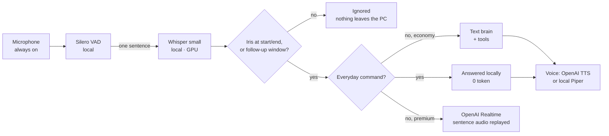
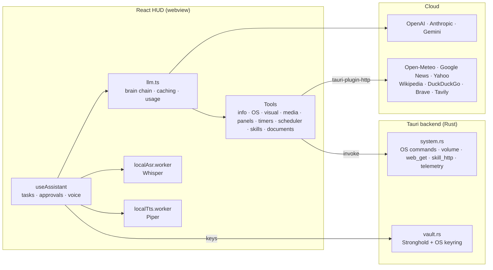

<p align="center"></p>

# I.R.I.S.

> **Iris**: a desktop AI assistant with a holographic HUD, always-on voice, long-term memory, web access, control of your computer, connections to external services, eyes on your screen, and the ability to write new skills for itself. It is designed to spend as few tokens as possible.


Iris is a cross-platform desktop app built with **Tauri 2 (Rust)** and **React 19 / TypeScript**. It thinks with cloud LLMs (OpenAI, Anthropic or Google Gemini, with automatic fallback between them). It listens **locally**: voice detection and Whisper speech recognition run on your GPU, so nothing leaves the PC until you say "Iris". It **lives in the background**: closing the window leaves it in the notification area, with a small always-on-top window above the tray icon. Everything it does shows up in a green-on-black sci-fi HUD built around Iris’s animated eye, rendered with Three.js. The interface speaks **14 languages** (English by default).

---

## Table of contents

- [Features](#features)
- [Token economy](#token-economy)
- [How it works](#how-it-works)
- [Tech stack](#tech-stack)
- [Project structure](#project-structure)
- [Getting started](#getting-started)
- [Configuration](#configuration)
- [Using Iris](#using-iris)
- [Tool reference](#tool-reference)
- [Self-written skills](#self-written-skills)
- [Security model](#security-model)
- [Where data is stored](#where-data-is-stored)
- [Current limitations](#current-limitations)
- [Roadmap](#roadmap)

---

## Features

### 🎙️ Voice: always listening, no button
- **The microphone is on from launch.** A voice activity detector (Silero VAD) cuts the audio into sentences, and **Whisper small runs on your GPU** to transcribe them (Whisper base on the CPU without WebGPU). This happens entirely on your computer.
- **Iris only reacts when addressed by name**, at the start or the end of a sentence: *"Iris, open the calculator"*, *"Hey Iris, …"*, *"Open the calculator, Iris, please"*. An "Iris" prompt given to Whisper makes it spell the name right, and the usual misspellings ("Irisse", "Hiris", "Yris"…) are accepted too. Anything else said around the microphone is ignored and never leaves the PC.
- **Only her name makes her answer**: a sentence without "Iris" is ignored — with one exception, the **answer to a question she has just asked** (*"Voulez-vous que je l’ouvre ?"* → *"oui, vas-y"*), within 8 s. People talking around her, or the echo of her own voice, never start a request.
- **Talking over her pauses her**: the moment you start speaking while she talks, her voice **pauses at once**, suspended mid-syllable. If your sentence starts or ends with *"Iris"*, she drops the rest of her reply and answers you; otherwise — someone else talking, her own echo, a cough — she carries on exactly where she stopped. She never stays stuck in pause: after 12 s at most she goes on. *« Iris, stop »* and **Esc** silence her too.
- **She recognises your voice** (optional, set up at first launch): you read three sentences, and Iris keeps a **voiceprint** — 256 numbers from a small speaker-recognition model (ResNet34 trained on VoxCeleb, 25 MB, downloaded once), never the recording — in `<app data>/memory/voices.json`. With *"Also listen to other people"* off, a sentence that would do something (her name, the answer to her question, a spoken yes / no) is only taken **from a recorded voice**: someone else saying "Iris, …" is ignored. In a longer sentence she keeps **only the stretches in a known voice**, 1.5 s windows at a time, and transcribes those again — someone talking around your request is cut out. Several voices can be recorded (**Settings → Recognised voices**: add, record again, rename, delete). Measured on synthetic voices: the same voice on two sentences ≈ 0.8 cosine similarity, two different voices ≈ 0.1; the thresholds (0.55, 0.50 per window) sit between, and every check is logged (`[iris:voices]`).
- **"Iris, arrête d'écouter"** / "stop listening" / "mets-toi en veille": she acknowledges, and after that only her name wakes her.
- **"Iris?"** on its own: she answers *"Oui, monsieur ?"* and listens (0 tokens).
- **Instant acknowledgement**: when a spoken request takes a moment, Iris says *"Je regarde ça, monsieur."*, *"Je m'en occupe."* or *"Je vous prépare ça."* right away, fitting the tool at work (web, computer, creation). She says it as soon as a slow tool starts, or after 1.2 s of silence, and never when the answer comes quickly. These phrases are synthesized once, a few seconds after launch, and replayed from memory: no tokens, no waiting.
- **Two voice modes** (Settings):
  - **Economy** (default): your locally transcribed sentence goes to the text brain, and the reply is spoken sentence by sentence. It costs text tokens only, with the same tools and abilities.
  - **Premium**: OpenAI Realtime speech-to-speech over WebRTC. It's the most natural, but billed in audio tokens. The local listener still guards it: the session only opens when Iris hears her name, replays that sentence's audio into the call, and closes after 30 s without being addressed.
- **Her voice follows the AI account**: connected to OpenAI, she speaks with OpenAI’s natural voice; connected to Gemini, with **Gemini’s natural voice**; connected to Claude (which has no voice), with the **free local voice** — Piper, computed on the PC, offline, a French and a British female voice chosen per sentence — unless an OpenAI or Gemini key is added for the voice and images. The local voice can also be chosen with any provider.
- **The eye follows your voice**: its pupil opens and its audio bars move as you speak, even on standby, so you can see that Iris hears you.

### 🪟 Always there, in the background
- **Closing the window doesn't quit Iris**: it keeps running in the **notification area** (tray icon) and keeps listening.
- **Start with Windows** (Settings → Personality, **off by default**): once enabled, Iris starts at login straight into the tray (mini window), ready to listen and to keep her scheduled reminders. Turning it off removes the login entry.
- A **mini window** appears above the tray icon, **always on top** of other applications. It shows Iris’s eye (following your voice), Iris's status and her last reply. You can drag it, open the interface from it (⤢, click or double-click), or hide it (×).
- **Ctrl+Shift+J** from any application shows or hides the interface. **Clicking the tray icon** does too, and its menu offers *Afficher Iris*, *Mini fenêtre* and *Quitter*.
- **By voice**: *"Iris, montre-toi"* / *"affiche ton interface"* brings the interface back, even minimized. *"Cache-toi"* hides it (back to the mini window). *"Cache la mini fenêtre"* / *"réaffiche la petite fenêtre"* toggle the mini window. *"Mets-toi en haut à gauche"*, *"déplace la mini fenêtre en bas à droite"* and *"place ta fenêtre au centre"* move a window to a corner, an edge or the centre of its screen.

### 🖱️ Mouse, keyboard and windows
- **Windows**: *"mets le navigateur à gauche"*, *"agrandis le traitement de texte"*, *"réduis le bloc-notes"*, *"envoie le lecteur de musique sur l'autre écran"*, *"ferme la facture"*. `manage_window` finds the window by words of its title and acts through the Windows API. It focuses, minimizes, maximizes, restores, closes (politely: the app may ask to save), or moves the window to a half, a quarter, the centre, or the next screen. It's instant, precise and needs no screenshot.
- **Anything else in another application**: *"clique sur Télécharger dans le navigateur"*, *"ouvre le menu Fichier et exporte en PDF"*, *"coche la case Se souvenir de moi"*. `use_computer` hands the goal to a vision sub-agent that works **one action at a time**. At each step it sees a screenshot of the active window's screen plus the window's **accessible elements** (buttons, fields, links, menus… with their exact position, from Windows UI Automation). It picks an action (click an element by number or at a point, type, keyboard shortcut, scroll, drag, wait), does it, and looks again, up to 20 steps. Only the latest screenshot is sent each time, and the main conversation only receives the outcome.
- **Safety**: an approval card before a task (outside autonomous mode). **Esc anywhere, or moving the mouse, stops Iris at once.** Before anything irreversible (sending, buying, deleting, submitting a form, installing) the sub-agent stops and Iris asks you. It never types passwords or card numbers, and text on the screen is never taken as instructions. Iris's own windows get out of the way during the task, and approval cards bring the interface back.
- The steps are decided by the **"Model for visuals and code"** when one is set (a stronger model locates things better).

### 👁️ Eyes on your screen
*"Iris, qu'est-ce que je regarde ?"*, *"que veut dire cette erreur ?"*, *"résume cette page"*: Iris takes a screenshot of the screen under the mouse, hiding her own interface for the shot if it is in front. A vision model describes it for your question, and the screenshot is shown as a card. Only the **description** enters the conversation, not the image, which would be re-sent (and billed) at every later step.

### 🧠 Long-term memory
- **Facts about you**: say *"Iris, retiens que mon manager s'appelle Claire"* (`remember`) or *"oublie mon adresse"* (`forget`). Iris also notices lasting facts by herself while summarizing the conversation (preferences, people, projects, habits; can be turned off). They're given to the model with every request, in the cached part of the prompt.
- **Each session starts fresh** (default): when Iris is opened, the previous conversation is archived as it is, with no AI call, and the new one starts empty. That means fewer tokens and no old topic mixed into new questions, and Iris still finds the old conversation when you ask *« de quoi on avait parlé… »*. A page reload during a session keeps the conversation. **Settings → Long-term memory → “Resume the last conversation”** restores it at launch instead, and the new conversation then continues from the previous one's summary. Long-term facts (*« retiens que… »*) and pinned dashboards and alerts stay across sessions either way.
- **Past conversations**: clearing the conversation (🗑) archives it, with a summary in a journal and its text in an archive. *"De quoi on avait parlé pour le voyage ?"* → `recall_memory` searches facts, journal and archive by keywords.
- **Knowledge graph**: the same summary call also lists the notable entities and their relations (so **no extra request**), and what the tools look up is added locally (a city whose weather you asked, a share you follow, a Wikipedia article…). `recall_memory` searches the relations too, `forget` removes the entities it names, and each node can be forgotten from the graph panel. Stored in `graph.json`; follows the "long-term memory" setting.
- **Settings → Long-term memory** lists the facts (delete them one by one), shows the archive's size, and offers "Erase all memory" (graph included).

### 🔌 Connected services (MCP)
Plug Iris into your email, calendars, smart home, code hosting, notes, files… through **[MCP](https://modelcontextprotocol.io) servers**, configured in **Settings → Connected services (MCP)** in the usual `mcpServers` JSON format (stored encrypted in the vault):

```json
{
  "mcpServers": {
    "fichiers": { "command": "npx", "args": ["-y", "@modelcontextprotocol/server-filesystem", "C:/Users/me/Documents"] },
    "maison": { "url": "http://my-server.local:8123/api/mcp", "headers": { "Authorization": "Bearer <token>" } }
  }
}
```

Each server's tools become Iris's tools (`mcp_<server>_<tool>`), both by voice and in writing. The ones the server doesn't declare read-only ask for your approval (outside autonomous mode), and long results are truncated. Command servers (`npx`, `uvx`…) are started by Rust. URL servers go through the standard `mcp-remote` adapter (Node.js needed). The connection state appears in Settings and in the telemetry.

### 🔔 Alerts on live data
*« Préviens-moi si le bitcoin passe sous 80 000 »*, *« si l’indice dépasse 8 200 »*, *« si mon action bouge de 3 % »*, *« s'il pleut à Lyon »*, *« s'il fait plus de 30 °C »*. `set_alert` watches a quote or the weather **on this computer**: Yahoo every minute, Open-Meteo every 10 minutes, with no AI call and no token while it waits. When the condition is met, Iris rings and says it (*« Monsieur, alerte : Bitcoin sous 80 000 USD — 79 850 USD en ce moment. »*). Each alert fires once and **survives restarts**. Running alerts sit in the task tray with their last reading, and cancelling the task cancels the alert (or *« annule l'alerte sur le bitcoin »*). If the condition is already met when it's set, Iris says so instead.

### 🗓️ Reminders and scheduled tasks
*« Rappelle-moi à 17 h d'appeler Claire »*, *« chaque lundi à 9 h, fais-moi un résumé des marchés »*, *« tous les matins à 8 h, affiche mon écran du matin et fais-moi un point »*. `schedule_task` keeps them on disk (`schedule.json`): they **survive restarts**, sit in the task tray with their next time (cancelling the task cancels them, or *« annule le point du matin »*, *« quels sont mes rappels ? »*). Three kinds: a **reminder** said as it is (0 tokens), a **request** run for you as if you had just said it, and a **pinned dashboard** shown (then optionally a request). Waiting costs nothing; a request costs its tokens when it runs.
- **"Puis-je vous interrompre ?"**: when a request or a dashboard is due while you're busy (Iris talking, a request running, you spoke in the last minute), she asks first — aloud and on a card, answered by voice or click.
- **Missed while closed**: a one-off reminder is still said at the next launch (with the time it was due, up to 12 h late); a repeating task waits for its next time.
- **Timers too survive a restart** (`timers.json`): a timer still running goes on, one that ended while Iris was closed is mentioned.

### ⚡ Instant answers without AI (0 tokens)
The time, the date, "open the calculator", timers ("mets un minuteur de 10 minutes", "1h30", "une heure et demie"), volume up/down/mute, showing / hiding / moving Iris's windows, "stop", "stop listening" and "Iris?" are recognised in French and English and **answered on the computer itself**. Anything these patterns aren't sure about goes to the AI.

### 💬 Conversation
- **Typed conversation** with a configurable brain (OpenAI, Anthropic or Gemini). If the chosen provider fails, hits a quota, or doesn't start answering within 7 s, Iris switches to the next provider that has a key.
- **A separate model for visuals and code**: an inexpensive model for the conversation and a stronger one only where it matters. Both are **chosen automatically from the keys you enter**, and follow new releases (or pick them by hand in Settings).
- **Parallel tasks**: every request (typed or spoken) is a *task* in the tray. Several run at once, their spoken replies take turns, and each can be cancelled on its own.
- **Iris persona**: courteous, calm, dry British wit, with a configurable honorific ("Monsieur" becomes "sir" in English). Strict honesty rules stop it from inventing facts, schedules or events.
- **Bilingual French/English**: replies in the language you speak, even when tool results or web pages are in another language.
- **Startup greeting** built only from real data (the clock).

### 🌍 Interface in 14 languages
English by default; **Settings → Interface** switches at once (the mini window and the tray menu follow) between English, 中文, हिन्दी, Español, Français, العربية (right to left), Português, Русский, 日本語, Deutsch, Bahasa Indonesia, Italiano, 한국어 and Türkçe. Dates, numbers and plurals follow the language. Every string lives in `src/i18n/`: one file per language, all shaped like `en.ts`, so a forgotten translation doesn't compile — adding a language is one file and one line in `index.ts`.

### 🌐 Live information
News (Google News), weather (Open-Meteo), stocks, crypto and FX (Yahoo Finance), Wikipedia, **free, unlimited web search**, and **reading any web page**. Only the passages relevant to the question are kept from a page. Results appear as **briefing cards** in the HUD, and Iris only speaks a short summary.
- **Always the latest information, for free**: no key needed. Searches go to DuckDuckGo, then **Brave Search** (its own index) when DuckDuckGo limits automated queries, then Google News, then Wikipedia. Tavily is used first only if you add its key. A `recency` filter (day / week / month / year) keeps only recent results, and Iris is told that her own knowledge is dated: for versions, prices, office holders, scores or current events, she searches first and trusts recent sources. Brave's snippets carry the page's age (*"il y a 4 jours"*), and topic news are sorted newest first.

### 🖥️ Computer control
- Launch apps by name in French or English, open websites, files and folders
- List, create, write, move/rename files, and delete them to the Recycle Bin
- **System volume** (up / down / mute) and **timers / reminders** that ring and speak when they end (tray, cancellable)
- Shell commands (PowerShell / `sh`, 60 s timeout)
- **Autonomous mode** (actions run immediately) or **approval mode** (approval card with a risk level)

### 📊 Ready-made widgets for any data
Iris **shows** information with the HUD's own widgets instead of generating UI. `show_data` sends only the data, a few dozen tokens, and the widget appears at once in the Visual panel. Generating a web page for the same thing would take thousands of output tokens and seconds of streaming:
- **Map**: places on the **interactive holographic globe** (drag to turn, wheel to zoom, click a beacon) or a **flat world map**, with the list of items beside it and the selected one's details. Iris only gives **place names**, which are located for free: built-in world regions (*Moyen-Orient*, *Sahel*, *Golfe persique*…), then Open-Meteo (countries, cities), then OpenStreetMap Nominatim (straits, landmarks…). They're remembered on the PC. A label can differ from its place (*"Discours du pape"* → *Paris*), and a category colours and tags it (*France*, *Iran*…).
- **Chart**: line, area, bars (horizontal for long names) or donut. Crosshair or per-mark tooltips, a legend and direct labels for several series, a table view, and a switch between the forms.
- **Table** (sortable, numbers aligned), **key figures** (value, ▲▼ change), **timeline** (dated events), **cards** (items with a tag, value, details, link).
- **Distances and values on the map**: every arrow is labelled with its exact **great-circle distance** (*« 9 713 km »*, or *« AF006 · 5 837 km »* with its own label). The list beside the map gives each leg and the itinerary's total, and Iris receives the same figures, so she says them instead of estimating. Places with a value show it next to their name (*« BERLIN · 3,7 M »*).
- **Zoom by voice**: *« zoome sur l'Europe »*, *« montre-moi le Japon de plus près »*, *« dézoome »*. Iris sends the map on screen a camera order (`focus` = a place, `zoom` from 1 = world to 10), and the globe or the map flies there smoothly. A country is centred on its middle, not its capital. With the mouse: the wheel zooms (towards the pointer on the flat map), and dragging turns the globe or pans the map. **Coastlines and borders** (Natural Earth, built in) are drawn as glowing lines that stay sharp when zoomed in, while the dotted land fades out.
- **Routes and arrows**: flights, the legs of a trip or flows are drawn as animated great-circle arcs, dashed and flowing towards their end, with a comet and an arrowhead. On the globe they fly above the surface; on the flat map they're split at the date line. Iris gives `routes` by place name, or `connect` to join the items in order (an itinerary).
- **Heat map** (`map_mode: "heat"`): a value per country colours the whole country, on the globe and the flat map, with a sequential blue ramp (a log scale when values span ×100 or more, such as population or GDP). It comes with a legend, a ranking with bars, and the country and its value under the mouse. Countries are known **offline** from a built-in 1° grid of Natural Earth's 177 countries (7 KB), with their French and English names, usual aliases (*USA*, *Angleterre*…) and ISO codes. Microstates too small for the grid (Luxembourg…) appear as a coloured dot.
- **Live widgets, without the AI**: key figures and cards can be `live` (a quote or the weather), and **the stock and weather cards** of `get_stock_quote` / `get_weather` are live too. They refresh themselves from the same free sources (Yahoo Finance every minute, Open-Meteo every 10 minutes) with a *"LIVE · 20s ago"* badge. Nothing is fetched while the window is hidden, and **no AI request is ever made to update them**.
- **Guided tour**: *« fais-moi visiter mon voyage »*. With `tour`, the map flies to each stop **as Iris names it**: the voice reports each sentence as it starts being heard, and the map follows the place it mentions. Without narration (typed request, voice off), it moves on by itself every few seconds; the **▶ Tour** button starts or stops it. Outside a tour, a place Iris names is selected and turned to, without zooming.
- **Cities as landmarks**: once zoomed in, about 580 major cities (capitals and cities over 750,000 inhabitants, Natural Earth, built in, with French names) appear. Megacities come first, then smaller ones as the zoom grows, and a label never covers another label, a place of the map or a distance tag.
- **Pinned dashboards**: *« garde ce tableau de bord »* (or the **Pin** button) pins the widget on screen to a dashboard. *« épingle ça dans mon écran du matin »* makes named dashboards. They come back **at every launch** in their own panel, with one tab per dashboard, and live figures keep refreshing, so **0 tokens once pinned**. *« Affiche mon écran du matin »* and *« ferme le tableau de bord »* are local commands.
- *"Ajoute Berlin"*, *"et le Japon ?"*: `revise_previous` adds the new items (or routes) to the widget on screen.
- Colours follow a validated categorical palette (readable with colour-vision deficiencies, on the dark HUD surface). The widget's data can be copied or saved as JSON.

### ✨ Creation
- **`create_visual`**, for what you ask Iris to **create**: web pages, apps, games, custom dashboards, diagrams, SVG logos, documents and code, streamed **live** into a sandboxed Visual panel (view code, copy, save, open in the browser). Follow-ups such as "make it blue" revise the visual on screen. To just show data, Iris uses the widgets above, unless you ask her to design a custom page.
- **`generate_image`**: image generation with OpenAI or Gemini (whichever the account brings), saved to `Pictures/Iris`.
- **Document analysis**: PDFs, images, Word `.docx`, text/code files. They're sent with the question and the next two, then only named, and `reread_document` brings one back when a later question needs it.

### 🧠 Self-improvement
When no tool fits, Iris can **write a new skill** (a script, a public HTTP API call, or a procedure over its tools), install it after you approve it, and use it right away.

### 🛸 The HUD
- **Iris’s eye** at the centre, in 3D: an iris drawn as a camera aperture — six blades around a hexagonal pupil, glowing radial fibres, a catchlight — in bright green on black. Its pupil breathes on standby, opens wide when listening, closes and spins while thinking and pulses with the voice; the eye glances toward the mouse, and a ring of audio bars follows your voice or Iris’s
- **The same eye as the logo**: animated in the top bar, in the mini window (dilating with the voice) and in the boot sequence, and as the app icon (`src-tauri/icons/icon.svg`, all sizes generated with `npx tauri icon`)
- **Glass panels** (conversation, knowledge graph, briefing, visual) that you can drag, resize, hide, and that Iris can rearrange herself. Like desktop windows, the one you click or drag comes to the front, and a panel that opens appears in front (always below the top bar and the dock). Every side and corner resizes, from a grip zone that straddles the border, so it is easy to catch and never under a scrollbar. The panels themselves can't scroll: only their content does.
- **The conversation follows the reply** as it is written, unless you have scrolled up to read: it then stays where you are until you come back to the bottom
- **Holographic data views**: a dotted **3D globe** (orthographic, see-through far side, scan line) turns to the place of a weather forecast, a Wikipedia place or a news topic that is a city or country, and marks it with a beacon. It runs offline, from a land mask built into the code. **Animated market charts**: the line draws itself with a glowing area, the last price pulses, a crosshair reads any point, and 1D / 5D / 1M / 6M / 1Y / 5Y buttons load the history (Yahoo, free)
- **A real knowledge graph**: the people, places, organisations, projects and topics of your life around you, with their relations (*Claire → manager de → Vous*). Nodes grow with mentions, recent ones glow, and you can click one to see its links or forget it. See [Long-term memory](#-long-term-memory)
- **Sound design per tool**: each kind of tool has its own short synthesized cue when it starts. News is a teletype, searches a sonar ping, markets a ticker, the computer a servo, creation a shimmer, memory two low notes…
- **Telemetry**: clock, CPU, memory, voice mode, local listening status, and a **consumption meter** (AI vs local requests, input tokens and cache share, output tokens, Realtime audio, OpenAI voice characters). The meter also shows **the cost of the day and of the month in euros, with the US dollars billed by the providers in brackets** (*« 0,039 € (0,045 USD) »*), and what the prompt cache and the tool selection saved today. Hover the cost for its breakdown by model. *Uptime* counts from Iris's own launch: Windows' own uptime keeps running through a fast-startup shutdown.
- Cinematic boot sequence (the eye opens, then the systems report in), faint scanlines, synthesized UI sounds, "Test the speed of my models" benchmark

---

## Token economy

Every measure below keeps the same abilities; the telemetry meter shows their effect live.

| Measure | Where | Effect |
|---|---|---|
| **Local listening** | `localWake.ts`, `localAsr.worker.ts` | Nothing is sent until "Iris" is heard: no tokens for ambient speech. |
| **Economy voice mode** | `useLocalVoice.ts` (`onSpeech`) | Spoken requests use text tokens (local transcript → text brain → TTS) instead of Realtime audio tokens, which cost many times more. It's also faster to wake: no session to connect, no audio replay. |
| **Answers without AI** | `localCommands.ts` | Time, date, timers, volume, opening apps, stop, standby, "Iris?": **0 tokens**, instant. |
| **Dynamic tool selection** | `toolGroups.ts` | The ~32 tool definitions weigh **~5,800 tokens, re-sent at every step**. Only a core set goes every time (live info, open, volume, timers, memory: ~2,000 tokens), and the other groups (files, computer, creation, widgets, HUD, scheduler, skills, services) join when a **local intent check** of the request's words asks for them. Groups used in the last two exchanges stay for follow-ups ("mets-le en bleu"). If the guess missed one, a small `load_tools` tool lets the model add it mid-request, with its guidance. Measured: **−48 % to −65 %** of tool tokens per step. The instructions also shrink: the folder list only goes with the file tools. A `[iris:tools]` log line shows the selection of each request. |
| **Explicit Gemini cache** | `geminiCache.ts` | Gemini's instructions + tools are stored as a *cached content* the first time a prefix is seen (the request's next steps and the following requests use it), then referenced instead of re-sent, billed at the cached rate. It works below the AI SDK, as its fetch, and lasts 10 minutes, extended while in use. If the cache is refused or expired, the full request goes out as before. A `[iris:cache]` log line reports it. |
| **Prompt caching** | `llm.ts` (`turnContext`, `CACHE_OPTIONS`) | The instructions no longer contain anything that changes between requests: the clock and the detected language are sent with the latest message. So the start of every request (tools + instructions + earlier messages) is identical and billed at the providers' cached rate. It's explicit for Anthropic (`cacheControl`), and a stable `promptCacheKey` is used for OpenAI; Gemini caches implicitly. The redundant list of tool names was also removed from the instructions. |
| **Documents** | `documents.ts` | A document is sent with its question and 2 follow-ups, then replaced by its name. `reread_document` re-attaches it (through `prepareStep`) only when needed. Before, every PDF was re-sent with each of the next 20 messages. |
| **Fresh sessions** | `useConversationMemory.ts` (launch), Settings | By default a session starts with an empty conversation: the previous one isn't re-sent (about 700 tokens per request saved) and its summary isn't added either. It's archived, not lost. |
| **Lighter tool steps** | `compactSteps.ts` | At each step, the results of the tools called at the *earlier* steps are cut to their first 700 characters with a note (the model already used them; it can call the tool again). The latest results stay whole. A web page read at step 1 is no longer paid in full again at steps 2, 3, 4… A `[iris:tools]` log line gives the tokens saved per step. |
| **Conversation summary** | `useConversationMemory.ts` (`summarize`), `memoryTools.ts` | Beyond ~10 exchanges, older messages are replaced by a summary of at most 150 words, written by the inexpensive model in the same call that notes lasting facts and the knowledge graph's entities. The history no longer slides message by message, which also keeps the prompt start stable for the cache. |
| **Tool result cache** | `tools.ts` (`cached`) | The same quote (2 min), news or search (10 min), page (10 min), weather (15 min) or Wikipedia article (24 h) asked again reuses the previous result. |
| **Screen as text** | `screenTools.ts` | A screenshot is described once by the vision model; only the description stays in the conversation. |
| **Lean web results** | `web.ts` (`relevantExcerpt`), `tools.ts` | A page read gives the model ~4,000 characters: the passages matching the question plus the start of the page. Before, it gave the first 12,000 characters. Search results: 6 × 300 characters, down from 8 × 600. Tool results are re-sent at every following step, so this adds up. |
| **Live widgets** | `hud/widgets/live.tsx` | Quotes and weather on screen refresh from the free APIs directly: following a price all afternoon costs 0 tokens instead of a question to the AI each time. |
| **Widgets instead of generated UI** | `widgetTools.ts`, `hud/widgets/` | Maps, charts, tables, key figures, timelines and cards come from ready-made components: the model sends ~50–300 tokens of data instead of a generated page (often 3,000–8,000 output tokens, streamed by the stronger model), and place names are geocoded for free instead of being written as coordinates. |
| **Model routing** | `llm.ts` (`BrainRole`), `lib/modelDefaults.ts` | An inexpensive model for the conversation and tool calls, and a stronger one only for visuals and code. Both are picked automatically from each saved key's model list: newest mini / Haiku / Flash for the conversation, newest GPT / Sonnet / Pro for visuals: the newest generation, stable before preview at the same version (no `-nano`, too weak for tool calls, and no `-pro`, very expensive). A model its provider refuses as gone (*« no longer available to new users »*) is set aside and replaced by the next best one automatically. |
| **Short thinking** | `llm.ts` (`thinkingOptions`) | Conversation requests to reasoning models think briefly: `reasoningEffort: low` for OpenAI GPT-5+ / o-series, thinking off for Gemini 2.5 Flash, `thinkingLevel: low` for Gemini 3+. Thoughts are billed as output tokens and delay the first spoken word; visuals and code keep the provider's default. The speed test uses the same settings. |
| **Local voice** (optional) | `localTts.worker.ts`, `tts.ts` | Piper voices computed on the PC: replies cost nothing to speak. |
| **Alerts and dashboards** | `alerts.ts`, `lib/dashboards.ts` | Watching a price or the weather, and keeping a live dashboard on screen, cost **no tokens at all**: the checks go straight to the free APIs. |
| **Cost meter** | `lib/costs.ts`, Telemetry | Each request is priced from its tokens and its model: approximate public list prices, editable in Settings. It adds up per day and per month (kept 2 months), in euros at the day's rate (Yahoo) with the US dollars alongside. It also counts what the cache saved (cached tokens × the price gap) and what the tool selection saved (definitions not sent × input price). A **daily budget** makes Iris warn once a day when it's reached. |
| **Meter** | `lib/usage.ts`, Telemetry | Tokens (with cache share), Realtime audio, TTS characters and local answers since launch, plus one `[iris:usage]` log line per request. |

---

## How it works





**A request's path.** `useAssistant.send()` first tries `matchLocalCommand()`. Otherwise it creates a task, builds the tool set, and `selectTools()` keeps the core tools plus the groups the request's words call for, with `load_tools` for the rest. Then `streamReply()` (Vercel AI SDK `streamText`, with `activeTools`) streams the answer through up to 6 tool steps. The cacheable prefix comes first and the turn context is appended to the latest message. On Gemini, the instructions and tools go through the explicit cache (`geminiCache.ts`). A spoken request that takes a moment gets a local acknowledgement. The answer is spoken sentence by sentence as it arrives, and the usage is recorded at the end.

**Windows.** Rust (`windows.rs`) creates the tray icon, the global shortcut and a second, transparent, always-on-top window labelled `mini`. The same web app renders the mini HUD there (`App.tsx` checks the window label). Iris itself runs only in the main window, which is hidden, never closed. It sends the mini window its status and voice level through Tauri events (`lib/miniWindow.ts`). `window_control` shows, hides or moves either window in its screen's work area.

**Human in the loop.** Tools only *propose* actions. Unless autonomous mode is on, an approval card must be accepted before the Rust command runs (and even in autonomous mode, a risky action after outside content in the same request asks first: `untrusted.ts`), and Rust applies its own checks (absolute paths, protected system folders, no overwriting, deletion to the Recycle Bin).

**Local models.** Three onnxruntime-web builds coexist: vad-web and Piper share the WASM build, and Transformers.js uses the WebGPU one. `vite.config.ts` resolves which version each library actually uses, and the code imports each binary with `?url`, so each ships once and works offline. Whisper and Piper run in Web Workers so the HUD never stalls.

---

## Tech stack

| Layer | Technology |
|---|---|
| Desktop shell | Tauri 2 (Rust 2021): tray icon, plugins `http`, `opener`, `stronghold`, `log`, `global-shortcut`, `autostart` |
| Screen capture | `xcap` + `image` (JPEG, ≤ 1600 px) |
| Computer control | `enigo` (mouse, keyboard), `uiautomation` (Windows UI Automation), `windows` (Win32 window management) |
| External services | `@ai-sdk/mcp` (MCP client) over a Rust stdio bridge; `mcp-remote` for URL servers |
| Frontend | React 19, TypeScript 6, Vite 8 |
| LLM orchestration | Vercel AI SDK v7 (`ai`, `@ai-sdk/openai`, `@ai-sdk/anthropic`, `@ai-sdk/google`), Zod schemas |
| Local listening | `@ricky0123/vad-web` (Silero VAD v5), `@huggingface/transformers` (Whisper small on WebGPU, base on WASM) |
| Voice output | OpenAI `gpt-4o-mini-tts`, or `@mintplex-labs/piper-tts-web` (Piper, local) |
| Premium voice | OpenAI Realtime (WebRTC), `gpt-4o-transcribe` |
| 3D / motion | Three.js, React Three Fiber, drei, postprocessing (bloom), Framer Motion |
| Graph | React Flow (`@xyflow/react`) |
| Maps & widgets | Canvas 2D globe and flat map; Natural Earth land, countries and outlines built in; geocoding by Open-Meteo and OpenStreetMap Nominatim (free) |
| Documents | `fflate` (`.docx`), `marked` (Markdown) |
| Secrets | IOTA Stronghold vault, master password in the OS keyring (`keyring` crate) |
| System | `sysinfo`, `trash`, `tokio`, `reqwest` (rustls) |

---

## Project structure

```
Iris/
├── index.html, vite.config.ts, vitest.config.ts, tsconfig*.json, package.json
├── .github/workflows/test.yml   # CI: type-check + unit tests
├── src/
│   ├── main.tsx, App.tsx, ErrorBoundary.tsx
│   ├── i18n/
│   │   ├── index.ts           # The interface languages, current language, useT() hook
│   │   ├── en.ts              # English: the reference (its shape is the type every language follows)
│   │   ├── fr.ts, es.ts, …    # One file per language (14); a missing key is a compile error
│   │   └── plural.ts          # Plural forms by each language's rules
│   ├── lib/
│   │   ├── settings.ts        # Preferences (localStorage) + defaults + migrations
│   │   ├── secrets.ts         # API keys in the Stronghold vault
│   │   ├── skills.ts          # Store of self-written skills
│   │   ├── usage.ts           # Consumption meter (tokens, cache, audio, TTS, local answers)
│   │   ├── costs.ts           # Money: prices per model, cost per day/month in € (and USD), savings, budget
│   │   ├── dashboards.ts      # Pinned dashboards (named, restored at launch)
│   │   ├── narration.ts       # The sentence Iris starts saying (maps follow it)
│   │   ├── memory.ts          # Long-term memory: facts, journal, archive, saved conversation
│   │   ├── knowledge.ts       # Knowledge graph: entities + relations (summary call + tool results)
│   │   ├── miniWindow.ts      # Events between the main window and the mini window
│   │   ├── modelCatalog.ts    # Lists the chat / realtime models a key can use
│   │   └── modelDefaults.ts   # Picks the conversation / visuals models from each key's list
│   └── features/
│       ├── assistant/
│       │   ├── useAssistant.ts    # Central hook: tasks, requests and tools; assembles the hooks below
│       │   ├── useApprovals.ts    # Approval cards (queued), asked aloud, answered by voice
│       │   ├── useLocalVoice.ts   # Local listening → requests, barge-in, follow-ups, spoken approvals
│       │   ├── useLocalCommands.ts # Local commands (0 token) run from the HUD
│       │   ├── useBackgroundJobs.ts # Timers (persistent), alerts, scheduler, budget warning
│       │   ├── useConversationMemory.ts # Restore / archive at launch, summary, memory context
│       │   ├── assistantShared.ts # Types and constants shared by those hooks
│       │   ├── untrusted.ts       # Approval for risky actions after web / outside content; voice yes/no
│       │   ├── schedule.ts, scheduleTools.ts # Scheduler: when, store, schedule_task / cancel_schedule
│       │   ├── llm.ts             # Persona, stable prompt + turn context, caching, brain roles, fallback
│       │   ├── localCommands.ts   # Answers without AI (time, date, timer, volume, apps…) + set_timer
│       │   ├── localWake.ts       # Always-on local listening: VAD → Whisper → sentences
│       │   ├── localAsr.worker.ts # Whisper with an "Iris" prompt (Web Worker)
│       │   ├── localTts.worker.ts # Piper voices (Web Worker)
│       │   ├── wakeWord.ts        # "Iris, …" / "…, Iris" detection and stripping
│       │   ├── tts.ts             # Multi-channel sentence-by-sentence speaker (OpenAI or Piper)
│       │   ├── realtime.ts        # Premium voice: OpenAI Realtime WebRTC session
│       │   ├── tools.ts           # News, weather, stocks + history, Wikipedia, web search, read page, geocoding
│       │   ├── web.ts             # DuckDuckGo + Brave parsing, recency, readable text, relevant excerpts
│       │   ├── documents.ts       # Attachments, document follow-ups, reread_document
│       │   ├── osTools.ts         # Computer control + volume + approval flow
│       │   ├── sessionTools.ts    # stop_listening
│       │   ├── memoryTools.ts     # remember / forget / recall_memory + summary prompt
│       │   ├── screenTools.ts     # look_at_screen (screenshot → vision description)
│       │   ├── computerTools.ts   # list_windows, manage_window, use_computer (vision sub-agent loop)
│       │   ├── mcp.ts             # MCP client: config, stdio transport over Rust, tools, status
│       │   ├── toolGroups.ts      # Dynamic tool selection: groups, local intent check, load_tools
│       │   ├── compactSteps.ts    # Older tool results shortened between the steps of a request
│       │   ├── bargeIn.ts         # Cutting Iris off: interruption vs her own echo or noise
│       │   ├── geminiCache.ts     # Explicit Gemini context cache (fetch wrapper under the AI SDK)
│       │   ├── acknowledgements.ts # "Je regarde ça, monsieur." phrases for spoken requests
│       │   ├── widgetTools.ts     # show_data: ready-made widgets from data (map, chart, table…)
│       │   ├── geocode.ts         # Free geocoding: world regions → Open-Meteo → Nominatim, cached
│       │   ├── alerts.ts, alertTools.ts # Alerts on live data: conditions, watcher, set_alert / cancel_alert
│       │   ├── skillTools.ts, visualTools.ts, mediaTools.ts, panelTools.ts
│       │   └── language.ts, audio.ts, sfx.ts (UI sounds + one cue per tool)
│       └── hud/
│           ├── IrisHUD.tsx, ControlDock.tsx, Telemetry.tsx, SettingsPanel.tsx
│           ├── Orb.tsx                      # Iris's eye in 3D (aperture, fibres, voice bars, bloom)
│           ├── IrisLogo.tsx, IrisLogo.css   # The same eye as an animated SVG logo (top bar, mini window, boot)
│           ├── MiniHUD.tsx, MiniHUD.css   # The always-on-top mini window
│           ├── DashboardPanel.tsx         # The pinned dashboards panel
│           ├── cities.ts, citiesData.ts   # Major cities shown when zoomed in (Natural Earth, French names)
│           ├── GlassPanel.tsx, panelGeometry.ts, panelVisibility.ts
│           ├── ConversationLog.tsx, BriefingView.tsx, VisualView.tsx, KnowledgeGraph.tsx
│           ├── HoloGlobe.tsx, landMask.ts   # Holographic globe (canvas 2D, interactive) + built-in land mask
│           ├── FlatMap.tsx                  # Flat dotted world map (same mask)
│           ├── geo.ts                       # Great-circle routes and distances, arrowheads, tags, heat ramp, outlines loader
│           ├── outlines.ts                  # Built-in coastlines and borders (Natural Earth 1:110m, 48 KB)
│           ├── countries.ts, countryGrid.ts # Offline countries: 1° grid, names (FR/EN, aliases, ISO), centres
│           ├── widgets/                     # Widget, MapWidget, ChartWidget, DataWidgets (table, stats, timeline, cards),
│           │                                # live.tsx (quotes/weather refreshed without the AI), palette
│           ├── HoloChart.tsx                # Animated market chart with ranges and crosshair
│           └── ApprovalCard.tsx, BootSequence.tsx, HUD.css
└── src-tauri/
    ├── tauri.conf.json, Cargo.toml, capabilities/default.json
    └── src/
        ├── lib.rs      # Plugin + command registration
        ├── windows.rs  # Tray icon, mini window, Ctrl+Shift+J, close-to-tray, window_control, launch at startup
        ├── screen.rs   # capture_screen (screen under the mouse, JPEG)
        ├── computer.rs # Windows (Win32), accessible elements (UI Automation), mouse/keyboard (enigo), Esc abort
        ├── memory.rs   # memory_read / memory_write (JSON files in the app data folder)
        ├── mcp.rs      # MCP servers as child processes, relayed over stdin/stdout
        ├── system.rs   # OS commands, volume, shell, web_get, skill_http, files, telemetry
        └── vault.rs    # Vault master password (OS keyring / mobile sandbox file)
```

---

## Getting started

### Prerequisites

- **Node.js** 20.19+ or 22.12+ (required by Vite 8)
- **Rust** (stable) via [rustup](https://rustup.rs)
- The **Tauri 2 system prerequisites**: see [tauri.app/start/prerequisites](https://tauri.app/start/prerequisites/)
- A **WebGPU-capable GPU** is recommended for the local speech recognition (it falls back to the CPU with a smaller model)
- At least **one API key**: OpenAI, Anthropic or Google Gemini. OpenAI is needed for its voice, the premium voice mode and images.

### Install and run

```bash
npm install
npm run tauri dev      # development: Vite on :1420 + Tauri window
```

The first Rust build takes several minutes. On first launch the local speech model is downloaded once from Hugging Face (Whisper small ≈ 390 MB on WebGPU, Whisper base ≈ 73 MB otherwise). Piper voices (≈ 60 MB each) are downloaded the first time the local voice speaks.

### Build installers

```bash
npm run tauri build    # outputs to src-tauri/target/release/bundle/
```

### Tests

```bash
cd src-tauri && cargo test                                  # unit tests
cd src-tauri && cargo test -- --ignored --nocapture         # desktop tests: lists your windows, and drives a
                                                            # throwaway form with the mouse (moves the cursor!);
                                                            # also checks the free search engines answer
cd src-tauri && cargo test free_search_engines -- --ignored --nocapture   # only the search engines (internet)
npm test                                                    # unit tests (Vitest): tool selection, countries,
                                                            # distances, alerts, search parsers, Gemini cache,
                                                            # costs, local commands, widgets, scheduler,
                                                            # approvals after outside content…
```

---

## Configuration

On first launch, a **guided setup** opens: the interface language, then the **AI account** — pick OpenAI, Google Gemini or Anthropic Claude, open its key page, paste the key; Iris checks it and sets everything up (models, voice, images). Connected to Claude, the next step offers an optional OpenAI or Gemini key for the natural voice and images. Then **your voice**: three sentences to read, and whether Iris may also listen to other people (skippable: she then listens to everyone). Last, a few options (voice, how Iris addresses you, autonomous mode, start with Windows). **Settings → AI account** shows the connection and **Disconnect** erases the keys to switch provider. Keys are encrypted in the vault as soon as they're checked.

| What the account brings | OpenAI | Gemini | Claude |
|---|---|---|---|
| Conversation, tools, web, screen, computer control | ✅ | ✅ | ✅ |
| Natural voice | ✅ | ✅ | local voice, or an OpenAI / Gemini key |
| Images | ✅ | ✅ | with an OpenAI / Gemini key |
| Premium voice mode (real time) | ✅ | — | with an OpenAI key |

Everything else is in **Settings**, the technical part folded under **Advanced**.

| Setting | Default | Description |
|---|---|---|
| **Voice mode** | Economy | *Economy*: local transcription + text brain (text tokens). *Premium*: OpenAI Realtime (audio tokens, more natural). |
| **Iris's voice** | Natural | *Natural*: the voice of the connected provider (OpenAI or Gemini, billed with it). *Free local voice*: Piper, offline. |
| **AI account** | none | One provider (OpenAI, Gemini or Claude), connected with its API key; for Claude, an optional OpenAI or Gemini key for voice and images |
| Realtime model | `gpt-realtime-2.1` | Premium mode only. A "mini" Realtime model costs several times less. |
| OpenAI voice | `marin` | `cedar` is a deeper, male voice |
| Main language | system (`fr`/`en`) | `fr`, `en` or `multi` (auto); also sets the local Whisper language |
| Personal vocabulary | empty | Names given to the premium mode's speech recognition |
| Backup providers | none | *Advanced*: keys of other providers, used automatically if the main one fails or is too slow |
| **Choose the models automatically** | on | Per provider: both models below are picked from the list of models the key can use (see [Model routing](#token-economy)). Picking a model by hand turns it off for that provider. |
| Conversation model | automatic: newest `gpt-*-mini` · `claude-haiku-*` · `gemini-*-flash` | Per provider. A fast, inexpensive model is enough here. Before the key's list is known: `gpt-5-mini` · `claude-haiku-4-5` · `gemini-2.5-flash`. |
| **Model for visuals and code** | automatic: newest `gpt-*` · `claude-sonnet-*` · `gemini-*-pro` | Per provider: a stronger model used only by `create_visual` (and the `use_computer` steps) |
| Image model | automatic | OpenAI: `gpt-image-2.5-flare` (editable under *Advanced*); Gemini: its newest image model |
| Tavily API key | none | Optional AI answers in web search |
| Long-term memory | on | Iris notes lasting facts by herself (you can always ask her to remember or forget) |
| Resume the last conversation | **off** | Off: each session starts empty (the previous conversation is archived). On: it continues where it was left |
| Start with Windows | **off** | On: Iris starts at login, straight into the tray (Settings → Personality) |
| **Interface language** | English | 14 languages (Settings → Interface); Iris still answers in the language you speak |
| Connected services (MCP) | none | `mcpServers` JSON, stored encrypted in the vault |
| Honorific | empty | "Monsieur", "Madame", a first name… |
| Speak typed replies / Boot greeting / UI sounds | on | Spoken requests are always answered aloud. |
| Pause her when you talk over her | on | Talking over Iris pauses her; without "Iris" in the sentence she carries on |
| **Autonomous mode** | **on** | Actions and skills run without asking; off → approval cards |
| Daily budget | 0 (none) | In €: past it, Iris warns once a day (Settings → Costs) |
| Model prices | list prices | USD per million tokens (input / cached / output) for each model in use, editable in Settings → Costs |

---

## Using Iris

| Input | Action |
|---|---|
| **"Iris, …"** or **"…, Iris"** | Talk to Iris. The microphone is always on; there is no button. |
| Answering within 8 s a question she asked | Follow-up without her name |
| **"Iris?"** | "Oui, monsieur ?" and she listens (local) |
| **"Iris, stop"** / **Esc** | Cut her off (running tasks go on silently) |
| **"Iris, arrête d'écouter"** / "mets-toi en veille" | Standby: only her name wakes her |
| **Ctrl+Shift+J** (anywhere) / click on the tray icon | Show or hide the interface |
| Closing the window (✕) | Iris stays in the tray, listening; the mini window appears above the icon |
| **"Iris, montre-toi"** / **"cache-toi"** / **"mets-toi en haut à droite"** | Show / hide / move her interface (or the mini window) |
| **"Iris, qu'est-ce que je regarde ?"** | She looks at your screen |
| **"Iris, retiens que…"** / **"oublie…"** | Long-term memory |
| **Enter / Esc** with an approval card open | Allow / Decline |
| 📎 or drag & drop | Attach PDF, image, Word or text files |
| Double-click a panel header | Reset that panel's layout |

**Answered locally (0 tokens):** *"Affiche mon écran du matin"*, *"Ferme le tableau de bord"*, *"Quelle heure est-il ?"*, *"On est quel jour ?"*, *"Mets un minuteur de 10 minutes"*, *"Monte / baisse un peu / coupe le son"*, *"Ouvre la calculatrice"* (autonomous mode), *"Stop"*, *"Arrête d'écouter"*, and the same in English.

**Answered by the AI:** *"Quelle est la météo à Lyon et comment vont les marchés ?"*, *"Rappelle-moi dans 10 minutes de sortir le gâteau"* (`set_timer`), *"Chaque lundi à 9 h, fais-moi un résumé des marchés"* (`schedule_task`), *"Cherche la dernière version de mon framework préféré et résume le changelog"*, *"Fais-moi un tableau de bord comparant ces trois devis"* → *"mets-le en bleu foncé"*, *"Déplace tous les PDF de mes Téléchargements dans Documents/Factures"*.

---

## Tool reference

| Tool | Category | Approval needed* | Description |
|---|---|---|---|
| `get_news` / `get_weather` / `get_stock_quote` / `lookup_wikipedia` | Info | No | Live data, shown as cards (globe, market chart); `get_news` takes an optional `recency` |
| `search_web` | Info | No | (Tavily →) DuckDuckGo → Brave → Google News → Wikipedia, free; optional `recency` (6 compact results) |
| `read_webpage` | Info | No | Relevant passages of any page for a `question` (treated as untrusted) |
| `reread_document` | Documents | No | Re-attaches a document sent earlier in the conversation |
| `list_folder` | OS | No | Folder listing (read-only) |
| `open_app` / `open_website` / `open_file_or_folder` / `set_volume` | OS | Yes (low) | Launch or open things, change the volume |
| `create_folder` / `move_or_rename` | OS | Yes (medium) | Filesystem changes, never overwrite |
| `write_text_file` | OS | Yes (medium, high when overwriting) | Write a text file |
| `delete_to_trash` | OS | Yes (high) | Move to the Recycle Bin / Trash |
| `run_command` | OS | Yes (high) | PowerShell / `sh`, 60 s timeout |
| `set_timer` | Timers | No | Timer or reminder with a label, spoken when it ends (survives a restart) |
| `schedule_task` / `cancel_schedule` | Scheduler | No | Reminder, request or dashboard at a time or on given days; list / cancel them |
| `set_alert` / `cancel_alert` | Alerts | No | Watch a quote or the weather locally (above / below / move / rain / temperature / wind), spoken when it fires; cancel or list |
| `pin_widget` / `show_dashboard` | Widgets | No | Pin the widget on screen to a (named) dashboard; show, close or list dashboards |
| `show_data` | Widgets | No | Map/globe (markers, `routes` / `connect` arrows with distances, `map_mode: "heat"` per country, `focus` + `zoom` camera), chart, table, key figures, timeline or cards from data; places geocoded for free; `live` items refresh by themselves; `revise_previous` adds to the widget on screen |
| `create_visual` / `generate_image` | Creation | No | Live visuals the user asks to create (builder model) / images |
| `arrange_panels` | HUD | No | Move, resize, show or hide HUD panels |
| `control_window` | HUD | No | Show, hide or move the interface or the mini window |
| `look_at_screen` | Vision | No | Screenshot of the screen under the mouse, described by the vision model |
| `list_windows` | Computer | No | Open application windows, front-most first |
| `manage_window` | Computer | Yes (low; close: high) | Focus, minimize, maximize, restore, close, or move a window (halves, quarters, centre, next screen) |
| `use_computer` | Computer | Yes (high) | Mouse and keyboard in other applications, step by step, stoppable with Esc or the mouse |
| `remember` / `forget` / `recall_memory` | Memory | No | Long-term facts, and search in past conversations |
| `mcp_<server>_<tool>` | External | Yes, unless the server marks it read-only | Tools of the connected MCP servers |
| `stop_listening` | Voice | No | Spoken requests only: back to standby |
| `create_skill` / `run_skill` / `skill_*` | Skills | Yes | See below |

\* In approval mode. With **autonomous mode on (the default), nothing asks**, except a risky action (command, files, opening a file, mouse and keyboard, skills, non-read-only MCP tools) after outside content in the same request: see [Security model](#security-model).

---

## Self-written skills

When nothing fits, the model can call `create_skill` with one of three kinds:

| Kind | What it is | Safety |
|---|---|---|
| `script` | PowerShell / `sh` script. Parameters arrive as `IRIS_<NAME>` environment variables, never pasted into the script text. | Approval before install and each run (unless "Always allow") |
| `http` | One call to a public API, with `{param}` placeholders | `GET` runs directly; other methods ask first |
| `procedure` | Numbered steps built from existing tools | Normal tool approvals |

Skills are listed in **Settings → Skills created by Iris**, where you can enable, disable or delete them, and choose which ones run without asking.

---

## Security model

- **Keys**: in a Stronghold vault whose 256-bit random password lives in the OS credential store. The premium voice uses a short-lived client secret.
- **Microphone**: analysed locally; audio only leaves the PC after "Iris" (economy: as text; premium: the sentence's audio, then the live call).
- **Approvals**: in approval mode, every mutating action shows its exact parameters with a risk level. Local commands respect it: "open an app" is only handled locally in autonomous mode.
- **Rust-side guards** (`system.rs`): absolute paths only, no system folders, no overwriting on move, deletion to the Recycle Bin, validated app names, whitelisted volume actions.
- **Prompt injection**: web content is labelled untrusted, and the system prompt forbids acting on instructions found in pages, documents or tool results. **Even in autonomous mode**, once a request has read outside content (web search, web page, news, Wikipedia, a document, the screen, a skill or an MCP tool), any risky action that follows in that request (command, file write / move / delete, opening a file, mouse and keyboard, skills, non-read-only MCP tools) **asks for approval** first, with the reason on the card (`untrusted.ts`). In a spoken exchange the question is asked aloud and **"oui" / "non" answers it**.
- **Visual sandbox**: generated pages run in an `<iframe sandbox>` without same-origin access.
- **Mouse and keyboard**: `use_computer` asks first (outside autonomous mode), stops on Esc or as soon as you move the mouse, hands irreversible actions back to you, and never types secrets. Only use autonomous mode with it if you trust the model you chose. Window management never clicks anything: it uses the Windows API.
- **Screen**: captured only when you ask about it. The screenshot goes to your AI provider for the description, and is neither saved nor kept in the conversation. On-screen text is treated as information, never instructions.
- **MCP servers**: only started from your own configuration (never by the model), with the configuration encrypted in the vault. Tools the server doesn't declare read-only ask for approval outside autonomous mode. The read-only hint comes from the server itself, so only configure servers you trust.
- **Memory**: facts and archives stay in files on your computer. The model is told never to store passwords or secrets, and everything can be reviewed and deleted in Settings.

> ⚠️ **Autonomous mode is on by default.** In that mode, `run_command`, file operations and script skills run without confirmation — except after outside content in the same request (see above). A request with no web content can still be steered by what's in the conversation or memory, so keep approval mode if in doubt. See [security & robustness](#-security--robustness).

---

## Where data is stored

| Data | Location |
|---|---|
| API keys | `vault.hold` in the app data dir (Windows: `%APPDATA%\com.iris.assistant\`) |
| Vault password | OS credential store: service `com.iris.assistant`, account `stronghold-vault` |
| Settings, skills, panel layout | Webview `localStorage` (`iris.settings.v1`, `iris.skills.v1`, …) |
| Whisper model | Webview cache (downloaded once from Hugging Face) |
| Geocoded places (map widget) | Webview `localStorage` (`iris.geocode.v1`, at most 2,000 places) |
| Piper voices | Webview private file system (OPFS); the phonemizer comes from a CDN on first use |
| Generated images / saved visuals | `Pictures/Iris/` / `Documents/Iris/` |
| Long-term memory | `<app data>/memory/`: `facts.json`, `journal.json`, `archive.json` (last 3,000 messages), `conversation.json` (current conversation + summary; restored at launch only with “Resume the last conversation”), `graph.json` (knowledge graph, at most 400 entities) |
| MCP configuration | In the vault (`mcp` entry) |
| Alerts, dashboards, scheduled tasks, timers | `<app data>/memory/`: `alerts.json`, `dashboards.json`, `schedule.json`, `timers.json` (restored at launch) |
| Recognised voices | `<app data>/memory/voices.json`: one voiceprint (256 numbers) per voice, never audio |
| Launch at startup | Windows login entry (`HKCU\…\Run`), only while the setting is on |
| Costs per day, euro rate | Webview `localStorage` (`iris.costs.v1`: last 62 days; `iris.eurusd.v1`) |
| Token meter | **Memory only**: reset when the app closes |
| Logs | Tauri log dir; voice and usage diagnostics appear in the dev console (`[iris:wake]`, `[iris:voice]`, `[iris:usage]`) |

---

## Current limitations

- **Economy mode relies on the local transcript**. Whisper small on the GPU is good, but it's not the cloud's quality, and names or rare words can be misheard (the model is told so). Without WebGPU, Whisper base is less accurate.
- **The microphone is always open** (Windows' indicator stays on), and local Whisper runs on every sentence heard, which uses some GPU in a room where people talk a lot.
- **Talking over her with speakers** (no headset): her voice can reach the microphone and pause her for a moment; without her name in what was heard, she carries on. With a headset there is no echo at all; otherwise the pause can be turned off in Settings → Voice. In the premium Realtime mode, interruptions are handled by the Realtime session.
- **Voice recognition is not voice separation**: when someone speaks *at exactly the same moment* as you, their voice is in the same stretch of audio; the stretch is kept if yours dominates (usually, being closer to the microphone), and the other words may then be transcribed with yours. Speech before or after your request, in someone else's voice, is cut out. Each check adds about 0.3 s for a short sentence, up to 2 s for a long one (on the CPU). It doesn't cover the premium Realtime session once it is open (only the sentence that wakes it).
- **The local voice takes ~0.8 s per sentence** (first sentence of a reply), and needs its voice downloaded once. The phonemizer is fetched from a CDN on first use.
- **Premium mode** takes 3–5 s to wake (connection + replay), and while its session is open everything heard is transcribed by OpenAI (30 s at most without being addressed).
- **Scheduled tasks and timers need Iris running to ring** (in the tray is enough; "start with Windows" helps). Checked every 15 s, so a reminder can be a few seconds late (up to a minute when the interface is hidden and the webview slows down). Days and times are read from the model's arguments: "le premier lundi du mois" or "dans 3 jours à 9 h" depend on the model computing the date.
- **The token meter counts since launch.** The money meter keeps days, but its prices are approximate list prices (editable). It doesn't count the explicit Gemini cache's storage (a few cents an hour at most) nor MCP servers' own costs.
- **Alerts and live widgets need Iris running** (in the tray is enough). A hidden webview slows its timers to about one tick a minute, which is fine for these checks.
- **The guided tour follows the voice of the economy mode** (the sentences read by OpenAI TTS or Piper). In the premium Realtime mode, the map moves on by itself instead.
- **Volume** moves in steps (≈ 2 % on Windows, via media keys); there is no "set to 40 %".
- **Local commands** cover common French and English phrasings; anything else goes to the AI (at normal cost).
- **Tool selection is a keyword guess.** A request phrased unusually may miss a group: the model then loads it with `load_tools`, which costs one extra step. The words are French and English only.
- **The explicit Gemini cache** costs a little storage while it lives (10 minutes after the last use). Gemini only accepts prompts above a minimum size (about 1,000 tokens for Flash models); a refused prefix is not tried again for an hour. Each different tool selection is a different prefix, so it has its own cache.
- **Acknowledgements** are only for spoken requests. With the OpenAI voice, their first synthesis each session costs a few voice characters.
- **Memory search is by keywords**, not by meaning: "mon chef" won't find "manager". The facts themselves are always in the prompt, so this only affects `recall_memory` over past conversations.
- **In the background**, the main window is hidden, not closed. The webview may slow its timers while hidden, which doesn't affect listening (audio thread) or answers. The mini window's dot follows the microphone, but not Iris's voice while the interface is hidden.
- **The mini window** starts in the bottom-right corner of the main screen, above the notification area. It remembers neither its position nor its "hidden" state across restarts.
- **Computer control** is Windows-only for windows and accessible elements (mouse and keyboard work elsewhere, from screenshots only). Apps that don't expose accessibility (games, some Electron or canvas apps) are driven from screenshot pixels, which is less precise. Each step costs a vision call (one screenshot), so a 10-step task is about ten requests: the dedicated tools (windows, open app / website) are far cheaper when they fit.
- **MCP URL servers need Node.js** (`mcp-remote`). The first start of an `npx` server downloads it (up to 2 min).
- **Free web search scrapes public result pages** (DuckDuckGo, Brave): if both limit automated queries at the same time, Iris falls back to Google News and Wikipedia, and a change in their HTML would need a parser update (`cargo test free_search_engines -- --ignored` checks them). A Tavily key gives an API that doesn't depend on that.
- **The knowledge graph** gets its entities from the conversation summary, which is written after ~10 exchanges (or when the conversation is cleared), so people and projects appear with a delay; what the tools look up appears at once. Positions you drag are not saved across restarts.
- The small globe of a news or weather card shows one place. To place several (news by country…), Iris uses the map widget.
- **Map widget geocoding** needs internet for a place seen for the first time, and OpenStreetMap allows one lookup per second, so a first map of ten unusual places (straits, landmarks) takes a few seconds; cities, countries and regions are faster and everything is cached. A place no geocoder knows is listed as "not located".
- **Zooming** shows Natural Earth 1:110m outlines: at the closest zoom (10) coasts are simplified (about 10 km precision), and there are no roads or cities beyond the places given.
- **Heat maps** use Natural Earth's 1:110m countries on a 1° grid: borders are approximate, and microstates are dots. Values are matched to countries by name or ISO code; regions inside a country (French départements, US states) are not coloured, only placed as beacons.
- **Live widgets** follow quotes and the weather only (not news or other data); Yahoo's free quotes can be delayed by a few minutes on some exchanges, and a live widget stops refreshing when the conversation is cleared or the visual closed.
- **Widgets cover common shapes of data**; something they don't fit (a custom dashboard, a diagram, an app) still goes to `create_visual` when you ask for it. The widgets can't be opened in the browser (their data can be copied or saved as JSON).
- **The interface speaks 14 languages, the voice commands two**: the wake word, the answers without AI (time, timers, volume…), spoken yes / no and the acknowledgements understand French and English only; in the other languages the phrases to say are shown in English. Iris herself answers in any language the AI model speaks. The translations were written by an AI model: a native speaker’s review is welcome.
- Language detection is French/English only; no `.xlsx` / `.pptx`; at most 6 tool steps per request; no automated tests yet for the voice pipeline or the React components.

---

## Roadmap

Effort: 🟢 small · 🟡 medium · 🔴 large.

### ✅ Done

- **Local wake word**: local VAD + Whisper small with an "Iris" prompt, name at start or end, 8 s follow-up window, "stop listening", always-on microphone without a button
- **Token economy**: economy voice mode, answers without AI, prompt caching, lean documents and web pages, model routing, local Piper voice, consumption meter, conversation summary (T2), tool result cache (T3), models picked from the saved keys + short thinking for the conversation
- **Background mode** (R2): tray icon, Ctrl+Shift+J, close-to-tray, always-on-top mini window, window control by voice
- **Screen awareness** (R6), **long-term memory** (P1: facts, journal, archive, restored conversation), **MCP services** (P2)
- **System**: volume control (C3, partly), timers and reminders
- **Persistent scheduler + proactivity** (P4, R4): reminders, requests and dashboards at a time or every day / week, surviving restarts, with "Puis-je vous interrompre ?" when you're busy; **persistent timers**
- **Approvals after outside content** (S1), even in autonomous mode, **answerable by voice** ("oui" / "non"); **start with Windows** (R2, opt-in, straight to the tray)
- **`useAssistant.ts` split into hooks** (S8): approvals, local voice, local commands, background jobs, conversation memory
- **Knowledge graph** (R8) and **holographic data views** (R9: globe, animated market charts, per-tool sounds); **free web search** with a second engine (Brave) and recency filters
- **Ready-made widgets** (`show_data`: map/globe, chart, table, key figures, timeline, cards) instead of generated UI; panels come to the front when touched
- **Alerts on live data** (R11), **pinned dashboards** (R10), **guided tours** on the globe following Iris's voice, **major cities** when zoomed in, **cost meter in € (and USD)** with a daily budget (T5), **unit tests and CI** (S7); *En service depuis* now counts from Iris's launch
- **Fresh sessions** by default (the previous conversation archived, resumable in Settings), **older tool results shortened** between steps, Gemini models picked from the newest generation with **unavailable models replaced automatically**, Gemini cache created at first use
- **New look**: green-on-black HUD around Iris’s animated eye (an iris drawn as a camera aperture), the same eye as the logo and the app icon
- **Interface in 14 languages** (S9): English by default, chosen in Settings, extensible by adding one file (`src/i18n/`)
- **Talking over her pauses her**; only her name (or the answer to her question) starts a request
- **Voice recognition**: Iris can answer only the recorded voices, and keeps only your words when someone else talks around your request
- **Guided first launch and one AI account**: language, provider (OpenAI, Gemini or Claude) with its key checked at once, voice and images following the provider (Gemini’s natural voice added), disconnect to switch
- **Routes and heat maps** on the globe and flat map; **live widgets and cards** (quotes, weather) refreshed without the AI
- **Maps**: distances in km on the arrows and in the list (and given to Iris), values next to the places, zoom and focus by voice, coastlines and borders
- **Panels**: reliable resizing from every side and corner (the conversation log no longer scrolls its panel), the last message is no longer cut off at the bottom
- **Dynamic tool selection** (T1, −48 to −65 % of tool tokens), **explicit Gemini cache** (T7), **instant spoken acknowledgements**

### ⏭️ Next up

The next batch, in this order (details in the tables below):

| # | Improvement | Why / how | Effort |
|---|---|---|---|
| 1 | **Reminders without AI** (T6) | "Rappelle-moi à 17 h de…" recognised locally and sent straight to the scheduler: 0 tokens, like timers. | 🟢 |
| 2 | **Block the local network** (S3) | `web_get` / `skill_http` refuse `localhost` and private IPs after DNS resolution, so a booby-trapped page can't reach the PC or the router. | 🟢 |
| 3 | **Strict Content Security Policy** (S2) | Replace `"csp": null` with a strict policy for the interface. | 🟢 |
| 4 | **System alerts** (R4, further) | Low battery, full disk, CPU maxed out: watched locally and said aloud, like the alerts on live data. | 🟢 |
| 5 | **Scheduled tasks in Settings** | A list of reminders and scheduled tasks to review, edit or pause, besides asking by voice. | 🟢 |
| 6 | **Remembered mini window** (R2, further) | The mini window keeps its position and its hidden state across restarts. | 🟢 |
| 7 | **Semantic memory** (P1) | Search by meaning: "mon chef" also finds "manager". | 🟡 |
| 8 | **Voice tests with recorded audio** (S7, further) | Barge-in, spoken yes / no and the wake word tested from recordings in the headless Edge harness. | 🟡 |

### 💰 Even fewer tokens

| # | Improvement | Why / how | Effort |
|---|---|---|---|
| T1 | **Dynamic tool selection, further** | ✅ *Done: core set + groups by local intent + `load_tools` (−48 to −65 % of tool tokens).* Next: per-server selection of MCP tools (a server can add dozens), and learning which groups follow which phrasings from the `load_tools` calls. | 🟡 |
| T4 | **Local brain for small talk** | A small local model (running on the GPU) answers greetings and simple questions, and routes the rest to the cloud. | 🟡 |
| T5 | **Money, further** | ✅ *Done: cost per day and month in € (with USD), savings of the cache and the tool selection, daily budget warning.* Next: switch to a cheaper model (or the local voice) past the budget, and a monthly chart of spending. | 🟢 |
| T7 | **Caching, further** | ✅ *Done: explicit Gemini cache for instructions + tools.* Next: cache the stable start of the conversation too (summary + older messages) and show the money saved in the meter. | 🟢 |
| T6 | **More local commands** | Weather for "my city" from a cache, media play/pause/next, "rappelle-moi à 17 h", unit and currency conversions (from a daily rate). | 🟢 |

### 🎬 More realistic

| # | Improvement | Why / how | Effort |
|---|---|---|---|
| R2 | **Remembered mini window** | ✅ *Done: start with Windows (opt-in).* Next: remember the mini window's position and hidden state. | 🟢 |
| R10 | **Dashboards, further** | ✅ *Done: pinned widgets in named dashboards, restored at launch, live, shown by voice or at a scheduled time.* Next: dragging tiles to rearrange them. | 🟡 |
| R11 | **Alerts, further** | ✅ *Done: quotes and weather, above / below / move / rain / temperature / wind, fired once, persistent.* Next: repeating alerts, alerts on news keywords (« dès qu'on parle de SpaceX »). | 🟢 |
| R4 | **Proactivity, further** | ✅ *Done: scheduled briefings and dashboards, "Puis-je vous interrompre ?".* Next: alerts on CPU / battery / disk, and suggestions learned from habits ("vous consultez les marchés chaque matin : je vous les prépare ?"). | 🟡 |
| R5 | **A true Iris voice** | A distinctive voice of her own (a dedicated speech service, or a fine-tuned Piper voice for free local speech). | 🟢 |
| R6 | **Screen follow-ups** | Select a region with the mouse ("this part"), or watch a window over time ("tell me when the download finishes"). | 🟡 |
| R7 | **Presence detection** | Greet you when you sit down, pause when you leave (local webcam detection, opt-in). | 🟡 |
| R8 | **Knowledge graph, further** | ✅ *Done: entities and relations from the summaries and tools.* Next: merge duplicates ("Claire" / "Claire Martin"), a timeline view, and the graph's neighbourhood of the entities of a question given to the model. | 🟡 |
| R9 | **Holographic views, further** | ✅ *Done: globe, market charts, tool sounds, data widgets, routes and arrows, heat maps per country, live quote and weather widgets, alerts on live figures (R11).* Next: regions inside countries (départements, states), the knowledge graph's places on the globe, live news tickers. | 🟡 |

### ⚡ More powerful

| # | Improvement | Why / how | Effort |
|---|---|---|---|
| P1 | **Semantic memory** | Local embeddings (a small multilingual model on the GPU) so `recall_memory` finds by meaning, not only keywords; facts grouped by topic when there are many. | 🟡 |
| P2 | **MCP made easy** | A catalogue of ready-made servers (email, calendar, smart home, code hosting) with a guided OAuth setup instead of JSON, and per-server tool selection (with T1). | 🟡 |
| P3 | **Long-running agent tasks** | Planner/executor mode with a visible plan, checkpoints and a final report, beyond 6 steps. | 🟡 |
| P6 | **Full offline mode** | Local brain (a model running on the PC) as the last fallback: with local listening and Piper, Iris would work without internet. | 🔴 |
| P8 | **Code interpreter** | Sandboxed Python (Pyodide) to analyse CSV/Excel files and chart the results. | 🟡 |
| P9 | **Computer use, further** | ✅ *Done: windows, and mouse/keyboard with accessibility + vision.* Next: invoke accessible elements directly (UIA Invoke/Value patterns: no cursor movement at all), browser automation through the DevTools protocol for web pages, and recorded "routines" replayed without vision (0 tokens). | 🟡 |

### 🧰 More capable

| # | Domain | Proposal | Effort |
|---|---|---|---|
| C1 | **Calendar & email** | The common providers through OAuth: agenda, events, email drafts (approval to send). | 🟡 |
| C2 | **Smart home** | A smart-home hub: lights, heating, scenes ("Iris, I'm home"), many of them as local commands. | 🟡 |
| C3 | **Media & system controls** | Media keys, music players, brightness, Wi-Fi/Bluetooth, battery, processes, window management. | 🟢 |
| C4 | **Clipboard** | "Translate what I just copied". | 🟢 |
| C5 | **More document formats** | `.xlsx`, `.pptx`, OCR, export visuals as PDF/DOCX. | 🟡 |
| C7 | **Live interpreter mode** | Real-time translation between two people. | 🟡 |
| C8 | **More spoken languages** | ✅ *Done: the interface in 14 languages.* Next: the wake word, local commands, spoken yes / no and acknowledgements in those languages too. | 🟢 |
| C9 | **Mobile companion** | Android/iOS build (the Rust code already has `cfg(mobile)` branches). | 🔴 |

### 🔒 Security & robustness

| # | Issue | Proposal | Effort |
|---|---|---|---|
| S2 | `"csp": null` | A strict Content Security Policy | 🟢 |
| S3 | `skill_http` / `web_get` reach `localhost` and private IPs | Block them after DNS resolution (SSRF) | 🟢 |
| S4 | Protected folders hard-coded on `C:` | Resolve them from environment variables | 🟢 |
| S5 | Settings and skills in `localStorage` | Files in the app data dir, with export and integrity checks | 🟢 |
| S6 | `run_command` with full user rights | Allowlist / read-only mode, audit log | 🟡 |
| S7 | Tests | ✅ *Done: Vitest suite (119 tests, every interface language checked against English) and a GitHub Actions workflow (type-check + tests).* Next: tests for the voice pipeline with recorded audio (the headless Edge harness), and the React components. | 🟢 |

### 🗺️ Suggested order

1. **Next up** (see above): T6 reminders without AI, S3, S2, system alerts (R4), scheduled tasks in Settings, remembered mini window (R2), P1, voice tests (S7)
2. **The "real Iris" milestone:** R5 (voice), R4 further (habits), R6 (screen follow-ups)
3. **More reach:** P2 (MCP catalogue) with per-server tool selection, the rest of T6, C3
4. **Big bets:** P6 (offline), P9 (computer use), C9 (mobile)

